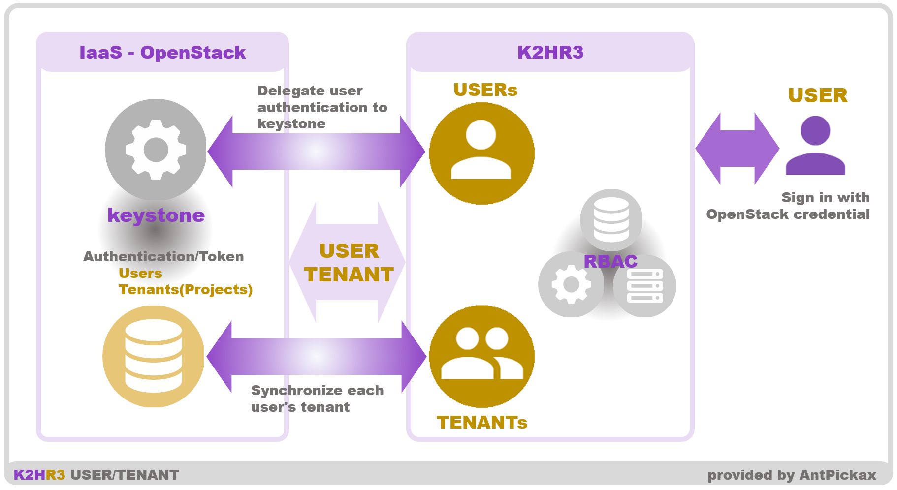
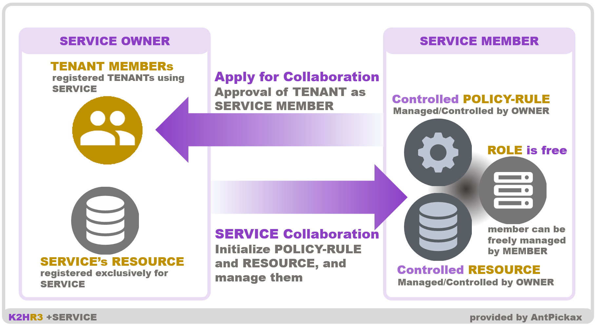
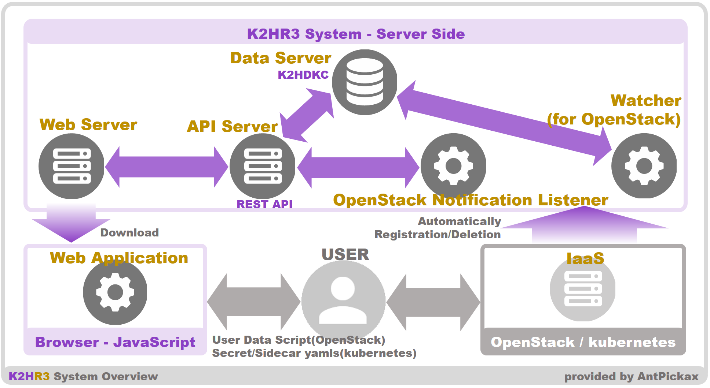

# Detail
This section explains detailed specification of K2HR3 and description of K2HR3 system configuration.
You can refer to [Overview](home.html) and [Feature](feature.html) before this section.

# USER and TENANT

The K2HR3 system does not manage **USER** and **TENANT**, but uses a user management system linked to the K2HR3 system.  
For example, if K2HR3 system cooperates with OpenStack, it uses OpenStack users and tenants(or projects) as K2HR3 **USER** and **TENANT**.  
For user management systems other than OpenStack, prepare additional programs that correspond to individual user management systems, set them in the K2HR3 system, and define them as K2HR3 **USER** and **TENANT**.  

## Cooperating with OpenStack
The figure below shows **USER** and **TENANT** defined by the K2HR3 system and the OpenStack which the K2HR3 system cooperates with.  

### USER and SignIn
The K2HR3 system defines the user of K2HR3 as **USER**.  

**USER** is the same as the user of IaaS(OpenStack) that the K2HR3 system cooperates with.  
By working with OpenStack, the K2HR3 system uses the user who signs in existing OpenStack as **USER** of K2HR3.  

When a user signs in to the K2HR3 system, the K2HR3 system delegates user authentication to the OpenStack Identity service(Keystone).  
Therefore, users of the OpenStack Identity service(Keystone) can use the K2HR3 system immediately.  

### TENANT
**TENANT** of K2HR3 system is the same as the tenant(or project) of OpenStack that works with the K2HR3 system.  
The K2HR3 system operates synchronizing the tenant(or project) information of OpenStack.  

Therefore, the **USER** of the K2HR3 system is automatically linked to **TENANT** which is the OpenStack tenant(or project) managed by the OpenStack OpenStack Identity service(Keystone).  

## Authentication system other than OpenStack
If K2HR3 system cooperates with authentication system other than OpenStack, prepare the code to access your user authentication system and configure it into the K2HR3 system.  
_For kubernetes(when not using OpenStack), refer to this contents._

### Preparation
You need to prepare a code to access your user authentication system.  
You can see the example code in [k2hr3_app/routes/lib/userValidateCredential.js](https://github.com/yahoojapan/k2hr3_app/blob/master/routes/lib/userValidateCredential.js) or [k2hr3_app/routes/lib/userValidateDebug.js](https://github.com/yahoojapan/k2hr3_app/blob/master/routes/lib/userValidateDebug.js).

### Setting
Copy the created dedicated code in the **routes/lib** directory where you extracted [K2HR3 Web Application](usage_app.html) (k2hr3_app).
Next, write this file name(without the extension **.js**) to **'validator'** element described in the **conf** file in the **config** directory.

### Operation
You can log in(sign in) from the [K2HR3 Web Application](usage_app.html) login(Siginin) dialog using the above settings.  
_This document will be expanded in the future._

# ROLE and POLICY-RULE and RESOURCE
The relationship between **ROLE**, **POLICY-RULE** and **RESOURCE** defined by the K2HR3 system is shown in the following figure.  

## ROLE
**ROLE** of the K2HR3 system is a group that accesses **RESOURCE**.  
**USER** defines and registers **ROLE** for each type of access to **RESOURCE** and for each group.  
**ROLE** is associated with **TENANT** to which **USER** belongs, and is managed separately by **TENANT**.  

**ROLE** is a definition of a group, and it is data for managing members accessing **RESOURCE**.  
This **ROLE** member is a host(**HOST**) that accesses the K2HR3 system [REST API](api.html) server, and is a host by on-premises and a virtual computing(Virtual Machine) and Podd(Conatiners) managed by IaaS(OpenStack, kubernetes).  
The IP address(and etc) information of the host(**HOST**) is registered as a member of **ROLE**.  

**ROLE** member registration can be automatically registered in conjunction with launch of OpenStack Virtual Machine or kubernetes Pods(Containers) which the K2HR3 system cooperates with.  
The **ROLE** member's ***HOST** is automatically deleted from the **ROLE** in conjunction with the deletion of Virtual Machine of OpenStack or Pods(Containers) of kubernetes.
In addition, **USER** can manually register/delete **ROLE** member's HOST using the [K2HR3 Web Application](usage_app.html).

## POLICY-RULE
**POLICY-RULE** of the K2HR3 system defines methods and types of access to **RESOURCE**.  
**USER** defines and registers **POLICY-RULE** for accessing to each **RESOURCE**.  
**POLICY-RULE** is associated with **TENANT** to which **USER** belongs, and is managed separately by **TENANT**.  

The K2HR3 system defines the following **POLICY-RULE** value.  
The user combines these values and registers **POLICY-RULE**.
- **READ**(readable)
- **WRITE**(writable)
- EXECUTE(executable) _reserved_

**USER** expresses the type of access to the target **RESOURCE** using the above definition and registers with **POLICY-RULE** with the target **RESOURCE**.  
The K2HR3 system makes **ROLE** access **RESOURCE** using **POLICY-RULE** which defines the access method to **RESOURCE**.

## RESOURCE
**RESOURCE** of the K2HR3 system is any type(text, binaries etc) of data that **USER** can freely define.  
**RESOURCE** is associated with **TENANT** to which **USER** belongs and is managed individually by **TENANT**.

As an example of **RESOURCE**, **USER** can register special data(setting, configuration etc) required by an application(program) running on **ROLE** member's **HOST** into **RESOURCE**.  
It can register tokens, certificates etc used by these application(program).  

**USER** can also register **RESOURCE** as a **dynamic data** that is a template(**TEMPLATE**)  used by the [K2HR3 Template Engine](usage_template.html)(described next section) provided by the K2HR3 system.  
This template(**TEMPLATE**) data allows you to define **dynamically RESOURCE** and to provide **RESOURCE** according to your situation.  

### **TEMPLATE**
**TEMPLATE** is text data describing the data(**RESOURCE**) which is expanded by the K2HR3 template engine.  
The user can quote the other **RESOURCE** and **ROLE** registered in the K2HR3 system to **TEMPLATE** and expand its contents when used.  
In addition, you can write simple arithmetic operations and conditional statements in **TEMPLATE**.  
The [K2HR3 Template Engine](usage_template.html) loads and expands this **TEMPLATE** and creates **dynamic RESOURCE**.  

You can see about this in [K2HR3 Template Engine](usage_template.html).

# Collaboration by +SERVICE
The following figure shows the outline of **SERVICE** and the **+SERVICE** function provided by the K2HR3 system.  

## SERVICE
**+SERVICE** is a function that supports the provision of **RESOURCE** across different **TENANT** and **ROLE** by the K2HR3 system.  
**SERVICE** defined by **+SERVICE** is data for this function and is data associated with **TENANT**.  

**+SERVICE** defines system service providers and users as **OWNER** and **MEMBER** respectively.  
**+SERVICE** uses **SERVICE** data to support cooperation between **OWNER** and **MEMBER**.  

_**+SERVICE** is a word indicating function, and **SERVICE** is a word indicating data for this **+SERVICE** function._  

## Usage
**OWNER**'s task of **RESOURCE** is to register **TENANT** of **MEMBER** and allow access to **RESOURCE**.  
**TENANT** of **MEMBER** permitted to use **RESOURCE** can freely define **ROLE** and its members to access the resource **RESOURCE**.  

Therefore, **OWNER** manages registration of **RESOURCE** to be provided, control of access method, **TENANT of MEMBER**.  
**MEMBER** manages the **ROLE** accessing the provided **RESOURCE** and manages the **HOST** of the **ROLE member**.  

# Collaboration with IaaS
The K2HR3 system works in cooperation with OpenStack or kubernetes as IaaS(Infrastructure as a Service).  
_In the case of kubernetes, cooperation with the user authentication system provided to kubernetes is required._  

The K2HR3 system links **USER** and **TENANT** for K2HR3 system with IaaS.  
Matching IaaS users/tenants(or projects) and **USER**/**TENANT** makes it easy to introduce the K2HR3 system into existing IaaS systems.  

And the K2HR3 system can automatically register/delete **ROLE** members by working with IaaS.  
Automatic registration and deletion of **ROLE** members will be explained below.  

## Automatically register to ROLE members
### OpenStack
The K2HR3 system automatically adds the instance to the **ROLE member** as the **HOST** by starting the OpenStack instance(Virtual Machine).  
This automatic registration process is implemented by using **User Data Script**(USER DATA SCRIPT) specified when OpenStack instance(Virtual Machine) is started up.  

This **User Data Script** is small text data that can be obtained by accessing the [K2HR3 Web Application](usage_app.html).  
**USER** can acquire **User Data Script** from [K2HR3 Web Application](usage_app.html) by explicitly specifying the **ROLE** which **USER** wants to add instance(**HOST**) to start.  
Pass the acquired **User Data Script** as a parameter for starting OpenStack instance(Virtual Machine).  

### kubernetes
In the case of kubernetes, when you start the Pods, specify the **Secret** setting and **Sidecar** to Pods and start it.  
The **yaml example code** for **Secret** and **Sidecar** can be obtained from the [K2HR3 Web Application](usage_app.html).  
Reflect the obtained yaml sample code to the yaml at the time of startup, and start the Pods.

## Automatically delete from ROLE members
### OpenStack
The K2HR3 system automatically deletes the instance(**HOST**) which is deleted by the OpenStack from the **ROLE member**.  
If the target instance(**HOST**) is created in OpenStack and automatically registered as a member in **ROLE**, **USER** can be automatically deleted from the **ROLE member** by deleting the instance(Virtual Machine) on OpenStack.  

This function is implemented by [**K2HR3 OpenStack Notification Listener**](detail_osnl.html).  
**USER** can use this automatic deletion function by starting the [K2HR3 OpenStack Notification Listener](detail_osnl.html) program provided by K2HR3.  
About this program, please refer to [K2HR3 OpenStack Notification Listener](detail_osnl.html).  

### kubernetes
In the case of kubernetes, in the same way as with OpenStack, in conjunction with the deletion of a Pods(Containers), the Pods(Containers) can be automatically deleted from the **ROLE member**.  
If the target Pod(Container) is cooperated by the K2HR3 system and is automatically registered, it is automatically deleted from the member simply by deleting the Pod(Container).

## Regular check and removal from ROLE members for OpenStack
Even if **USER** can not use [K2HR3 OpenStack Notification Listener](detail_osnl.html) program, **USER** can automatically delete that host(**HOST**) from the **ROLE member**.  
For this purpose, **USER** can launch the [**Watcher**](tools.html) program contained in the K2HR3 system.  

The [Watcher](tools.html) program regularly checks the existence of the **HOST** of the **ROLE member** automatically registered by working with IaaS(OpenStack).  
If **HOST** is deleted and does not exist, the [Watcher](tools.html) program automatically deletes that **HOST** from the **ROLE member**.  
Even if **USER** can not start [K2HR3 OpenStack Notification Listener](detail_osnl.html) program, **USER** can use the equivalent automatic deletion by running this [Watcher](tools.html) program.  

About this program, please refer to [Watcher](tools.html).  

## Automatically registration/deletion
### OpenStack
The outline diagram of automatic registration and deletion of OpenStack and ROLE members is shown below.  

### kubernetes
The outline diagram of automatic registration and deletion of kubernetes and ROLE members is shown below.  

# K2HR3 System Overview
A schematic diagram of the K2HR3 system is shown below.  

As shown in the figure, the K2HR3 system consists of a **Web application**, **Web server**, **API server**, **Data Server(K2HDKC)**, **K2HR3 OpenStack Notification Listener**, **Watcher** subsystem.  
Each subsystem is described in the following sections.  

## K2HR3 Web Application
The **Web Application** subsystem is accessed from the browser by **USER** and operates as the control panel of the K2HR3 system.  
This is a JavaScript based web application that can manipulate all of the data required by **USER**.  

**USER** can manipulate **ROLE**, **POLICY-RULE**, **RESOURCE**, **SERVICE** data using this **Web Application**.  

For details on how to use this subsystem, please see [Usage K2HR3 Web Application](usage_app.html).  
_K2HR3 Web Application is created with [React.js](https://reactjs.org/)._  

The source code of **K2HR3 Web application** is in [k2hr3_app Github repository](https://github.com/yahoojapan/k2hr3_app), and it is registered as a submodule in [k2hr3 Github repository](https://github.com/yahoojapan/k2hr3).  

## K2HR3 Web Server
The **Web Server** is a server that **USER** accesses to use the **K2HR3 Web Application**.  
JavaScript of the Web Application is loaded from the **Web Server** to the browser and executed.  
The **Web Server** is the server side JavaScript program running on [Node.js](https://nodejs.org/).  

The source code of **K2HR3 Web Server** is in [k2hr3_app Github repository](https://github.com/yahoojapan/k2hr3_app), and it is registered as a submodule in [k2hr3 Github repository](https://github.com/yahoojapan/k2hr3).  

## K2HR3 API Server
The **API Server** provides a [**K2HR3 REST API**](api.html) for manipulating data such as **ROLE**, **POLICY-RULE**, **RESOURCE**, **SERVICE** stored in the **Data Server(K2HDKC)**.  
Using the [**K2HR3 REST API**](api.html) provided by this **API server**, the Web Application/Web Server communicates with the **Data Server(K2HDKC)**.  
And **USER** and **HOST** of the **ROLE member** directly call this [**K2HR3 REST API**](api.html) on this **API Server**, and read/write **RESOURCE** data.

For details about **API Server** and **REST API**, see [**K2HR3 REST API**](api.html).  
The **API Server** and [**K2HR3 REST API**](api.html) is the server side JavaScript program running on [Node.js](https://nodejs.org/).  

The source code of **K2HR3 API Server** and **K2HR3 REST API** is in [k2hr3_api Github repository](https://github.com/yahoojapan/k2hr3_api), and it is registered as a submodule in [k2hr3 Github repository](https://github.com/yahoojapan/k2hr3).  

## K2HR3 Data Server(K2HDKC)
The **K2HR3 Data Server(K2HDKC)** is a server that stores and manages data such as **ROLE**, **POLICY-RULE**, **RESOURCE**, **SERVICE**, etc.  
This server is constructed with [**K2HDKC**](https://k2hdkc.antpick.ax/) which is **distributed KVS** provided by [**AntPickax**](https://antpick.ax/).  

For **K2HDKC** of distributed KVS, please see [**K2HDKC**](https://k2hdkc.antpick.ax/).  

## K2HR3 OpenStack Notification Listener
This server is the server running the [**K2HR3 OpenStack Notification Listener**](detail_osnl.html) program.  
This program uses OpenStack and automatically deletes target instances(**HOST**) from **ROLE members** in conjunction with deletion of instance(**HOST**) on OpenStack.  

For details on how to use this program, please see [K2HR3 OpenStack Notification Listener](detail_osnl.html).  

The source code of **K2HR3 OpenStack Notification Listener** is in [k2hr3_osnl Github repository](https://github.com/yahoojapan/k2hr3_osnl), and it is registered as a submodule in [k2hr3 Github repository](https://github.com/yahoojapan/k2hr3).  

## K2HR3 Watcher
**Watcher** is a program that **USER** uses as an alternative when **K2HR3 OpenStack Notification Listener** can not be used.  

For details on how to use this program, please see [Watcher](tools.html).  

The source code of **Watcher** is in [k2hr3_api Github repository](https://github.com/yahoojapan/k2hr3_api), and it is registered as a submodule in [k2hr3 Github repository](https://github.com/yahoojapan/k2hr3).  

# Various details
Common specifications and other details of the K2HR3 system other than the above are explained in [**Various Details**](detail_various.html).

