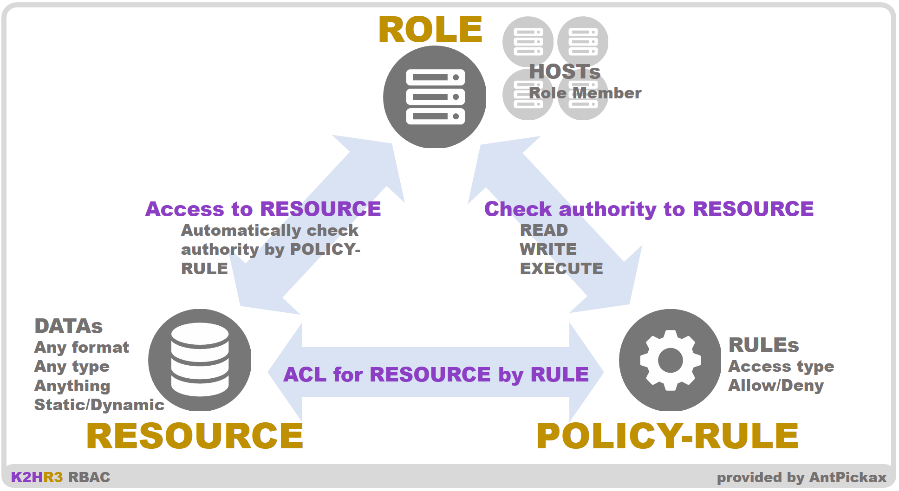

# **K2HR3** とは
Yahoo! JAPAN からオープンソースとして、[K2HR3](https://k2hr3.antpick.ax/indexja.html) を公開しました。  
K2HR3は、Yahoo! JAPANがオープンソースとして公開する [AntPickax](https://antpick.ax/indexja.html) プロダクトの一つです。  

## K2HR3とは
**K2HR3** (**K2H**dkc based **R**esource and **R**oles and policy **R**ules) は、Yahoo! JAPANオリジナルの **RBAC** (**R**ole **B**ased **A**ccess **C**ontrol) システムのひとつです。  
**K2HR3** は、**RBAC** としての機能を、**IaaS**（Infrastructure as a Service）である [**OpenStack**](https://www.openstack.org/) と連携して動作し、また**RBAC**を利用する上で便利な **+SERVICE** 機能を提供します。  

## 背景
あらゆるシステムやサービスは、システム・サーバー・ホスト・プロセスを組み合わせて提供しています。  

また、これらは情報・データや機能を提供するバックエンドシステムと、これを利用するユーザインターフェース含むアプリケーションなどのフロントエンドに分離した構成が多く存在します。  
このような構成は、バックエンドとフロントエンドのシステムが互いに接続・通信しています。  
そして、バックエンドとフロントエンドのシステム間において、アクセスの制御が必要となります。  

現在、このようなシステム間のアクセス制御のため **RBAC** (**R**ole **B**ased **A**ccess **C**ontrol) システムを導入し、ロールベースでアクセスの制御を行うことが望まれます。  
そして、RBACシステムを導入することにより、システム間を **疎結合** にできます。  

システムやサービスをクラウド環境で構築する場合、それらの最小構成であるプログラムは、ホスト、コンテナー環境の変化（追加・削除等）への柔軟な対応が必要となります。  
近年のRBACシステムは、このクラウド上の環境の変化を前提としており、システムやサービス構成の変更、およびそれらの運用を簡単にできることが要望されます。  

今後（既に）、システムやサービスを構築する場合、RBACシステムの導入もしくはその検討を行い、またプログラムや機能もRBACシステム前提で実装されると思われます。  

## K2HR3のゴール
前述のように、RBACシステムを使うプログラムや機能を実装する前提で、その開発者・運用者への負担をいかに小さくし、それらの可用性を高める要望があります。  
私たちは、開発者・運用者への負担を軽くできるRBACシステムとして、K2HR3を提供したいと考えています。  

私たちは、K2HR3のゴールとして、以下に示す代表的な指標を持っています。

### 開発者に負担をかけない
既に世の中には、いくつかのRBACシステムが存在します。  

それらのRBACシステムの提供する機能、利用できる機能など、まだまだ標準化されておらず、各々が特徴的な機能を提供しています。  
このような状況の中で、K2HR3は **開発者の負担を小さくする** ことを第一の目標にしてます。  

例えば、アクセスの制御をするために、認証・認可のためのデータ（例えばトークンなど）を使うRBACシステムがあります。  
このトークンをユーザのプログラムが直接利用する場合、トークンの生成・取得・利用をプログラムの中に実装する（もしくはライブラリを呼び出す）必要があります。  
また、開発者はそのトークンの管理・更新等も考えなくてはなりません。  

AWS（[Amazon Web Services](https://aws.amazon.com/)）のIAM（[AWS Identity and Access Management](https://docs.aws.amazon.com/IAM/latest/UserGuide/introduction.html)）は、有名なクラウド上のRBACシステムであり、トークンの取得、利用は非常に簡単にできます。  
しかし、IAMでもトークンの取得、利用のためのコードをユーザのプログラムに実装する必要があります。  

K2HR3は、アクセスのための認証・認可を **IPアドレスベース** で制御できるように設計してます。  
これにより、認証・認可に必要となるデータの生成・取得・利用のためのコードを **一切不要とすることも可能** であり、ユーザにとってメリットとなります。  
_ユーザのクラウド環境（IaaS）は、マルチテナントとシングルテナント（ユーザのプライベートクラウド環境など）に区別することができます。_  
_特に、プライベートクラウド環境のRBACシステムにおける認証・認可を考慮した場合、容易にIPアドレスベースのアクセス制御ができます。_  
_K2HR3は、マルチテナントとシングルテナントの両方において、可能な限りIPアドレスベースでの制御を可能とし、上述のメリットを享受できます。_  

K2HR3は、RBACシステムとして管理・制御される基盤として利用でき、ユーザのサービス・システムはそれを構成するプログラムが互いに依存せず分離・管理でき、疎結合にできます。  
そして、既存のプログラムやRBACシステムを持たない（利用できていない）プログラムをフロントエンドとして、このフロントエンドがRBAC（K2HR3）システムを使ったバックエンドを利用可能にします。  
つまり、**既存のプログラムにRBACシステムを導入可能** にします。  

われわれは、これを目標の一つとしてます。  

### 機能・情報の提供者と利用者の負担を小さく
RBACシステムを使って、機能や情報を提供するバックエンドのサービスを考えてみます。  
例えば、そのサービス（バックエンド）は、データーベースや分散ストレージなどです。  

このようなサービスを提供する場合、提供側と利用する（アクセスする）側で事前に、利用開始・利用許可等の **調整が必要** となります。  
また、利用中にサービス提供側の構成変更や、利用側の構成変更（ホスト追加・削除など）も発生し、その都度調整が必要となります。  
このような調整は、**双方の運用負荷** となり、これを低減させる要望があります。  

K2HR3は、サービスの提供者と利用者の権限を明確に定義・分離し、それぞれの権限の中で互いに影響を受けず、自由に変更ができるようにする機能（ **+SERVICE** ）を提供します。  
そして、サービスの提供者は、K2HR3を使って **自由にサービスを定義** することができます。  

K2HR3は、このように機能・情報（サービス）の **提供者と利用者の負担を小さく** することを目標としています。  

## K2HR3のRBAC機能の定義
RBACとは、ロールをベースとしたアクセス制御です。  

つまり、RBACを使うとき、「**誰が**」（**WHO**）を**ロール**として定義します。  
そして、アクセスの制御は、「**何を**」（**WHAT**）と「**どのように**」（**HOW**）の定義が必要となります。  

K2HR3は、「誰が」を**HOSTベースのロール**として定義し、「どのように」を**ポリシー/ルール**として定義します。  
そして、「何を」を**リソース**として定義し、この**リソースの定義に特徴**があります。  

K2HR3の**リソースは、あらゆる情報を対象**にでき、K2HR3の利用者が自由に定義できます。  
例えば、リソースに「**文字列**」「**バイナリデータ**」「**鍵**」「**トークン**」「**URL**」などを**自由に定義**できます。  

K2HR3では、**ロールはリソースにポリシー/ルールに従いアクセス**でき、取得・更新することができます。  

K2HR3は、環境（主にクラウド環境）に応じて、またはロールに応じて、**提供側がリソースを変化させることが可能**です。  
これは、アクセスする側（プログラムなど）を変更することなく、環境の変化への対応を可能とします。  

K2HR3は、既存プログラムの**変更なしに導入が可能**です。  
ユーザは、既存プログラムが必要とする情報（起動設定など）をK2HR3のリソースとして定義し、環境（クラウドなど）に応じた情報をリソースとして取り出せます。  
これにより、クラウド環境に対応できていない**既存プログラムに、RBACシステムを導入**することができます。  
例えば、SSLの鍵が必要であれば、それをリソースに設定することが可能です。  
そして、その鍵は提供側がK2HR3を通して、利用側に依存せず自由に変更することも可能とします。  

このように、K2HR3は「**ROLEがPOLICY RULEにより制御されたRESOURCEにアクセスする**」ための**基盤を提供**します。  

## K2HR3とOpenStack
K2HR3のユーザは、ロールを定義し、RBACシステムとして稼動できます。  

K2HR3において、このロールのメンバーは、**ホスト**であり、**IPアドレスベース**の情報となります。  
K2HR3は、IaaSの一つであるOpenStackと連携でき、IPアドレスのロールへの**自動登録と登録解除**をサポートします。  

既にOpenStackを導入した環境であれば、K2HR3を追加導入するだけで、**既存のOpenStackと連動したRBACシステム**を簡単に利用できます。  
_K2HR3とOpenStackは疎結合であり、K2HR3の導入において互いが影響することはありません。_  
このように、既存のIaaS（OpenStack）を使った環境に**簡単にK2HR3を導入できます**。  

K2HR3は、[セットアップ](https://k2hr3.antpick.ax/setupja.html)を参考に**試験的な導入が可能**です。  
ぜひお試しください。  

## K2HR3の+SERVICE機能
K2HR3は、**+SERVICE** と呼ぶ機能を提供します。  
この機能は、K2HR3のRBAC機能をベースとして、機能・情報（これをサービスと呼ぶ）を**提供する側とその利用側を疎結合で連携**させることができます。  

このサービスはK2HR3のユーザが自由に定義でき、ユーザが管理者として利用者の利用権限を認可できます。  
そして、利用者は許可されたサービスに対して、一定の権限の元で自由に利用できます。  

**+SERVICE** に近いシステムとして、[AWS](https://aws.amazon.com/) の [IAM](https://docs.aws.amazon.com/IAM/latest/UserGuide/introduction.html)（こちらはAWS向けのK2HR3よりも高機能なRBACシステムを提供しています）があります。  
IAMでは、サービスをAWSが提供し、サービスを利用するユーザをロールとして制御できるように機能が提供されています。  

K2HR3は、これと同様の基礎的な機能を提供します。
K2HR3の**+SERVICE**では、**サービスをK2HR3ユーザが自由に定義でき、ユーザ固有の環境に導入**できます。  

## K2HR3のメリット
以上のようにK2HR3は独自の**RBACシステム**であり、ユーザの環境に**簡単に導入**できます。  
K2HR3の利用は簡単であり、OpenStackと連動し、既存のユーザの持つクラウド環境で利用できます。  

K2HR3のRBACシステムは、ユーザのプログラム、システムの最小限の変更で利用でき、**サービスとしての連携機能**も提供・利用できます。  

## K2HR3の今後
今回、公開した時点のK2HR3は、まだまだ改良できるところや、追加すべき機能を残しています。  

今後、OpenStackだけではなくKubernetesへの対応を行いコンテナーと連動したロール管理ができるように計画しています。  
また、**+SERVICE** の機能向上も行っていきます。  
そして、K2HR3は開発者・運用者が簡単にシステム・サービスの構築・運用ができる環境を提供していきます。  

公開したK2HR3について、[ドキュメント](https://k2hr3.antpick.ax/indexja.html)、[ソースコード](https://github.com/yahoojapan/k2hr3)を参照してください。  
そして、今後のK2HR3に対して、ぜひ、ご意見、要望をお寄せください。
