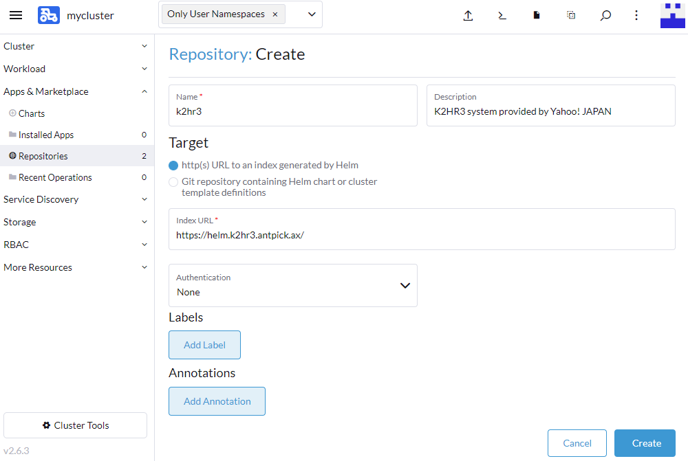
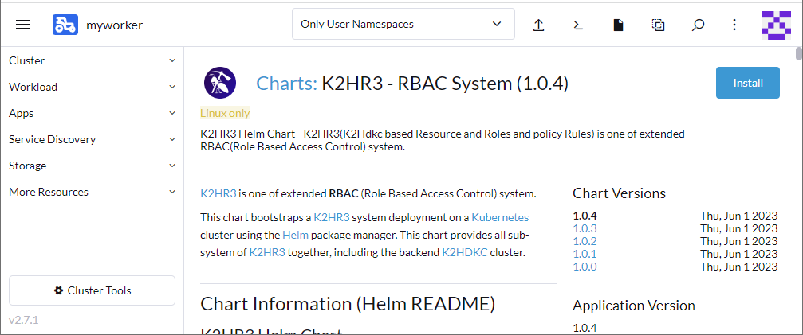
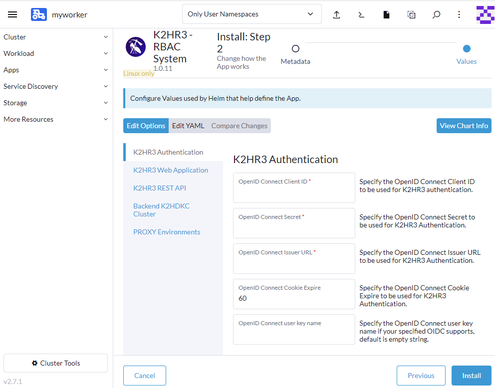
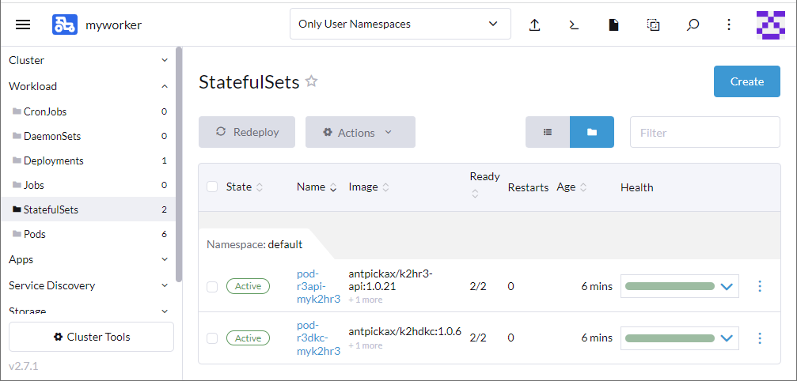
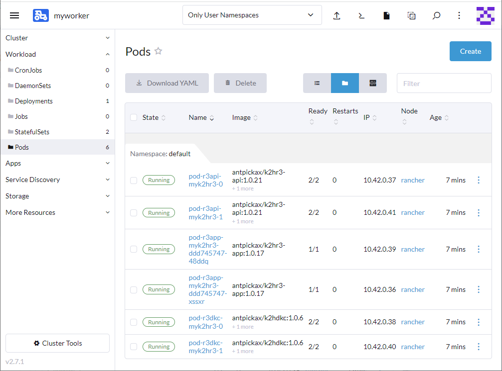
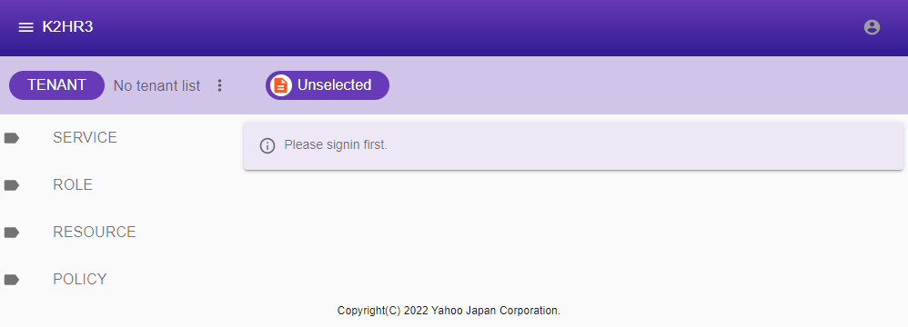
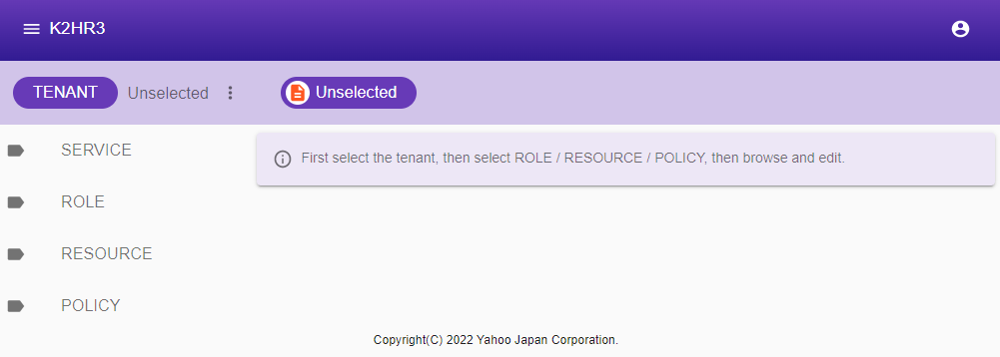

# RANCHER Helm Chart
**K2HR3 Helm Chart** は、[kubernetes](https://kubernetes.io/ja/)環境に [Helm](https://helm.sh/ja/)（Kubernetes用パッケージマネージャー） を使って **K2HR3システム** を構築するための **Helm Chart** です。  
この **K2HR3 Helm Chart** は、**RANCHER Helm Chart** として [RANCHER](https://www.rancher.co.jp/) から利用できます。  

## 概要
**K2HR3 Helm Chart** を **RANCHER Helm Chart** として [RANCHER](https://www.rancher.co.jp/)のリポジトリに登録できます。  
[RANCHER](https://www.rancher.co.jp/)のリポジトリに登録することで、簡単に K2HR3システム を構築することができます。  

**K2HR3 Helm Chart** は、Chartリポジトリを [K2HR3 Helm Chart repository](https://helm.k2hr3.antpick.ax/) で公開し、[Artifact Hub](https://artifacthub.io/packages/helm/k2hr3/k2hr3) に登録しています。  

[RANCHER](https://www.rancher.co.jp/) UIから、[Artifact Hub](https://artifacthub.io/packages/helm/k2hr3/k2hr3) で公開されている **K2HR3 Helm Chart**をリポジトリとして登録できます。  
K2HR3 Helm Chartのソースコードは、[k2hr3_helm_chart - Github](https://github.com/yahoojapan/k2hr3_helm_chart)で公開されています。  

### Helmコマンドから利用
**K2HR3 Helm Chart** は、通常の **Helm Chart** として利用できます。  
**K2HR3 Helm Chart** を `Helmコマンド` から利用する場合は、[こちら](helm_chartja.html) を参照してください。  

# RANCHERの使用方法
コンテナ・オーケストレーションとして、Kubernetes管理プラットフォームである [RANCHER](https://www.rancher.co.jp/) で、**K2HR3 Helm Chart** を使用する手順を説明します。  

以下の説明は、[RANCHER](https://www.rancher.co.jp/) 環境がセットアップされている前提としています。  
[RANCHER](https://www.rancher.co.jp/)のセットアップなどは、[RANCHER](https://www.rancher.co.jp/)を参照してください。  

## RANCHERクラスター
**K2HR3 Helm Chart** を使い K2HR3システムを展開する RANCHERのClusterを確認してください。  
必要に応じて、Clusterを作成してください。  

以下の図は、**RANCHER UI**にログインし、Clusterのリストを表示してます。  

  

以降の手順では、**mycluster** を使って説明します。

## リポジトリ追加
RANCHERのクラスター（`mycluster`）を選択し、クラスターの設定画面を表示します。  
左ペインの、`Apps & Marketplace` > `Repositories` を選択すると、以下に示すコンテンツが表示されます。  


このページにある **Create** ボタンをクリックして、**K2HR3 Helm Chart** をリポジトリとして登録します。

**Create** ボタンをクリックすると、以下に示す **Repository: Create**のページが表示されます。  

  

**K2HR3 Helm Chart** をリポジトリとして登録するために、以下の項目（必須）へ値を設定します。  

- Name  
`k2hr3` を入力してください。
- Target  
`http(s) URL to an index generated by Helm` を選択します。
- index URL  
`https://helm.k2hr3.antpick.ax/` を入力します。

上記の値を設定した後、**Create** ボタンをクリックします。  

  

以上で、上記に示すように、**K2HR3 Helm Chart** をRANCHERのリポジトリとして登録できました。  

## Chartインストール
次に、**K2HR3 Helm Chart** をインストールします。  

左ペインの、`Apps & Marketplace` > `Charts` を選択すると、利用できる `Chart`の一覧が表示されます。  

  

この Chart リストの中から `K2HR3` のChartを見つけてください。  

リストの `K2HR3` をクリックすると、**K2HR3 Helm Chart** をインストールためのページが表示されます。  

  

右上にある **Install** ボタンをクリックして次に進みます。  

### Chartインストール : Step 1
以下のように、`Install: Step 1` のページが表示されます。  

  

このステップでは、インストールするK2HR3システムの `名前` を入力してください。
上記の例では、`Name` に `myk2hr3` を入力しています。

入力したら、**Next** ボタンをクリックします。  

### Chartインストール : Step 2
以下のように、`Install: Step 2` のページが表示されます。  

  

このステップでは、以下の項目の設定をします。  
- K2HR3システムの認証設定
- K2HR3 Web Application（サブシステム）の設定
- K2HR3 REST API（サブシステム）の設定
- K2HDKCクラスター（バックエンドシステム）の設定
- PROXY環境変数の設定

それぞれの設定について、説明します。

#### K2HR3システムの認証設定
`Install: Step 2` ページ で、`Edit Option`を選択し、リストから `K2HR3 Authentication` を選択します。  

  

**K2HR3 Helm Chart** がサポートする `K2HR3システムの認証方式` は、[OpenID Connect](https://openid.net/connect/) です。  

この `K2HR3 Authentication` 設定で、K2HR3システムが使用する [OpenID Connect](https://openid.net/connect/) の情報を入力します。  

以下の項目は設定必須です。  
- OpenID Connect Client ID
- OpenID Connect Secret
- OpenID Connect Issuer URL

これら必須項目を入力したら、`K2HR3 Authentication`設定の入力は完了です。  

#### K2HR3 Web Application（サブシステム）の設定
`Install: Step 2` ページ で、`Edit Option`を選択し、リストから `K2HR3 Web Application` を選択します。  

  

この設定では、K2HR3サブシステムである `K2HR3 Web Application` の情報を入力します。  
以下の項目は設定必須です。  
- External hostanme or IP address

`K2HR3 Web Application`にアクセスするための、`Hostname(FQDN)`もしくは`IPアドレス`を入力してください。  
`K2HR3 Web Application`は、kubernetesの`NodePort`サービスとして構成されます。  
よって、この値には K2HR3システムを構築する RANCHERクラスター（`mycluster`）を構成する `Workerノード`のいずれかを設定してください。  
もしくは、環境に応じてこの`NodePort`サービスへ到達することができる`Hostname`等を設定してください。  

`K2HR3 Helm Chart`はリリースされた時点の最新の `K2HR3 Web Application` 用の `Dockerイメージ` を使用します。  
デフォルトでは、`antpickax/k2hr3-app:X.Y.Z`のイメージが使用されます。  
このページは、この`Dockerイメージ` を任意のイメージに変更できます。  
イメージを変更する場合は、オーガナイゼーション名、イメージ名、イメージタグを一括で設定するか、個別に指定できます。  

`K2HR3 Web Application`のデフォルトの設定を変更したい場合は、`Custom Configuration`に設定を上書きするための `local.json` を指定できます。  
この値は、`JSON String`で入力してください。  

`K2HR3 Web Application`が、`LOCAL TENANT`をサポートするか否かを指定できます。  
サポートをしない場合は、`Local Tenant`チェックボックスのチェックを外してください。  

これら必須項目を入力したら、`K2HR3 Web Application`設定の入力は完了です。  

#### K2HR3 REST API（サブシステム）の設定
`Install: Step 2` ページ で、`Edit Option`を選択し、リストから `K2HR3 REST API` を選択します。  

  

この設定では、K2HR3サブシステムである `K2HR3 REST API` の情報を入力します。  
以下の項目は設定必須です。  
- External hostanme or IP address

`K2HR3 REST API`にアクセスするための、`Hostname(FQDN)`もしくは`IPアドレス`を入力してください。  
`K2HR3 REST API`は、kubernetesの`NodePort`サービスとして構成されます。  
よって、この値には K2HR3システムを構築する RANCHERクラスター（`mycluster`）を構成する `Workerノード`のいずれかを設定してください。  
もしくは、環境に応じてこの`NodePort`サービスへ到達することができる`Hostname`等を設定してください。  

`K2HR3 Helm Chart`はリリースされた時点の最新の `K2HR3 REST API` 用の `Dockerイメージ` を使用します。  
デフォルトでは、`antpickax/k2hr3-api:X.Y.Z`のイメージが使用されます。  
このページは、この`Dockerイメージ` を任意のイメージに変更できます。  
イメージを変更する場合は、オーガナイゼーション名、イメージ名、イメージタグを一括で設定するか、個別に指定できます。  

`K2HR3 REST API`のデフォルトの設定を変更したい場合は、`Custom Configuration`に設定を上書きするための `local.json` を指定できます。  
この値は、`JSON String`で入力してください。  

`K2HR3 REST API`が、`LOCAL TENANT`をサポートするか否かを指定できます。  
サポートをしない場合は、`Local Tenant`チェックボックスのチェックを外してください。  

`K2HR3 Helm Chart`は、`K2HR3システム`が`Kubernetes`と連携し、その`Namespace`をテナントとして利用します。  
この`Namespace`へアクセスする権限が必要となるため、`Service Account`を作成します。  
この`Service Account`が不要な場合は、`Create Service Account`チェックボックスのチェックを外してください。  

これら必須項目を入力したら、`K2HR3 REST API`設定の入力は完了です。  

#### K2HDKCクラスター（バックエンドシステム）の設定
`Install: Step 2` ページ で、`Edit Option`を選択し、リストから `Backend K2HDKC Cluster` を選択します。  

  

この設定では、K2HR3バックエンドシステムである `K2HDKC Cluster` の情報を入力します。  
この設定では、必須項目はありません。  
この設定では、K2HR3システムで利用する `K2HDKC`および`CHMPX`のイメージを指定することができます。  
また、K2HR3システム全体で利用する 初期化用の`Init Container`のイメージを指定することができます。  
通常、これらの値は未設定のままとして、デフォルトの値を利用できます。  

`K2HR3 Helm Chart`はリリースされた時点の最新の `K2HDKC`、`CHMPX`、および `Init Container` 用の `Dockerイメージ` を使用します。  
デフォルトでは、それぞれ `antpickax/k2hdkc:X.Y.Z`、`antpickax/chmpx:X.Y.Z` および `alpine:X.Y.Z` のイメージが使用されます。  
このページは、これら`Dockerイメージ` を任意のイメージに変更できます。  
イメージを変更する場合は、オーガナイゼーション名、イメージ名、イメージタグを一括で設定するか、個別に指定できます。  

以上で、`Backend K2HDKC Cluster`設定の入力は完了です。  

#### PROXY環境変数の設定
`Install: Step 2` ページ で、`Edit Option`を選択し、リストから `PROXY Environments` を選択します。  

  

この設定では、K2HR3システム全体で利用する `PROXY`環境変数を設定できます。  
デフォルトでは、`RPOXY`環境変数は設定されません。
K2HR3システムを構築するネットワーク環境において `PROXY` 設定が必要な場合、`HTTP_PROXY`、`HTTPS_PROXY` および `NO_PROXY`環境変数を指定してください。  

以上で、`PROXY` 環境変数の入力は完了です。  

以上の `Install: Step 2` の各設定が終わったら、右下の **Install** ボタンをクリックします。

## Chartインストール完了
**K2HR3 Helm Chart** をインストールが開始され、完了すると以下の画面（`Apps & Marketplace` > `Installed Apps`）が表示されます。

  

`Deployed` バッジが表示されていれば、K2HR3システムの構築が成功しています。  

kubernetesの各サービスの状態を確認します。

### Deployments
**K2HR3 Helm Chart** がインストールした `Deployments` を表示します。  
左ペインの、`Workload` > `Deployments` を選択して確認します。  

  

`pod-r3app-myk2hr3`（`Name=myk2hr3`の場合） が表示され、`Active` バッジが表示されていれば、`Deployments`は成功しています。  

### StatefulSets
**K2HR3 Helm Chart** がインストールした `StatefulSets` を表示します。  
左ペインの、`Workload` > `StatefulSets` を選択して確認します。  

  

`pod-r3api-myk2hr3` と `pod-r3dkc-myk2hr3`（`Name=myk2hr3`の場合） が表示され、`Active` バッジが表示されていれば、`StatefulSets`は成功しています。  

### Pods
**K2HR3 Helm Chart** がインストールした `Pods` を表示します。  
左ペインの、`Workload` > `Pods` を選択して確認します。  

  

`pod-r3api-myk2hr3-[0,1]`、 `pod-r3app-myk2hr3-[xxx,yyy]`、`pod-r3dkc-myk2hr3-[0,1]`（`Name=myk2hr3`の場合）の合計6つのPod が表示され、`Running` バッジが表示されていれば、`Pods`は成功しています。  

## 動作確認
構築したK2HR3システムの動作確認をします。  

`K2HR3 Web Application（サブシステム）の設定` および `K2HR3 REST API（サブシステム）の設定` で設定した `External hostanme or IP address` と `External port number` を使います。  

### K2HR3 REST APIの確認
まず、最初に `K2HR3 REST API` へのアクセスを確認します。  
`K2HR3 REST API` は、`K2HR3 Web Application`からアクセスされるREST APIサーバなので、最初に確認する必要があります。  

`External hostanme or IP address` で設定した `Hostname` を使います。  
また、`External port number` で設定した `ポート番号`も必要となります。  
`External port number`は必須の設定項目ではないため、未設定とした場合は、`31443` となります。  

ブラウザから、以下のURLにアクセスしてください。  
```
https://<Hostname>:<Port number>/
```
ここまで説明した例を用いると、以下のURLになります。  
```
https://node1.mycluster.localhost:31443/
```

正常にアクセスできると、以下のテキストが表示されます。  
```
{"version":["v1"]}
```

#### 注意
**K2HR3 Helm Chart** が構築したK2HR3システムは、自己署名証明書を使っています。  
このため、ブラウザで表示しようとすると `この接続ではプライバシーが保護されません`等のエラーが表示されます。  
`詳細設定`などからアクセスを許可してください。  
（上記は、Google Chromeで表示される文言ですので、お使いのブラウザに応じた操作をしてください。）

### K2HR3 Web Applicationの確認
次に `K2HR3 Web Application` へのアクセスを確認します。  

`External hostanme or IP address` で設定した `Hostname` を使います。  
また、`External port number` で設定した `ポート番号`も必要となります。  
`External port number`は必須の設定項目ではないため、未設定とした場合は、`32443` となります。  

ブラウザから、以下のURLにアクセスしてください。  
```
https://<Hostname>:<Port number>/
```
ここまで説明した例を用いると、以下のURLになります。  
```
https://node1.mycluster.localhost:32443/
```

正常にアクセスできると、以下の画面を表示します。  

  

次に、右上にあるボタンをクリックして、`Sign in`を選択し、サインインします。  

  

正常にサインインできると、以下の画面のように右上のサインイン状態を示すアイコンが白く表示されます。  

  

以上で、`K2HR3 Web Application` および K2HR3システムが正常に動作していることを確認できました。  

#### 注意
**K2HR3 Helm Chart** が構築したK2HR3システムは、自己署名証明書を使っています。  
このため、ブラウザで表示しようとすると `この接続ではプライバシーが保護されません`等のエラーが表示されます。  
`詳細設定`などからアクセスを許可してください。  
（上記は、Google Chromeで表示される文言ですので、お使いのブラウザに応じた操作をしてください。）

## 最後に
以上で、[RANCHER](https://www.rancher.co.jp/) と **K2HR3 Helm Chart** を使い、K2HR3システムを構築できます。  

上記例では、必須項目のみを設定してK2HR3システムを構築しましたが、もっとカスタマイズすることもできます。
`Chartインストール : Step 2` で表示されている項目以外をカスタマイズする場合は、`Edit YAML`を選択して、直接 **K2HR3 Helm Chart** の`values.yaml`の値を編集できます。  

  

変更できる値は、`heml`コマンドを使って **K2HR3 Helm Chart** をカスタマイズする場合と同じです。  
各変数の定義、デフォルト値は、[K2HR3 Helm Chart オプション](helm_chartja.html)を参照してください。  

以上のように、**K2HR3 Helm Chart** を **RANCHER Helm Chart** として[RANCHER](https://www.rancher.co.jp/)で利用すれば、簡単に K2HR3システムを構築できます。  
