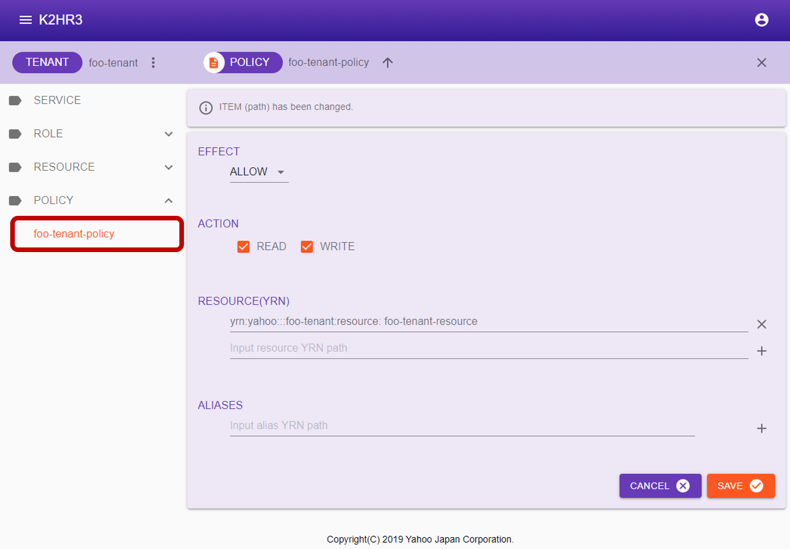
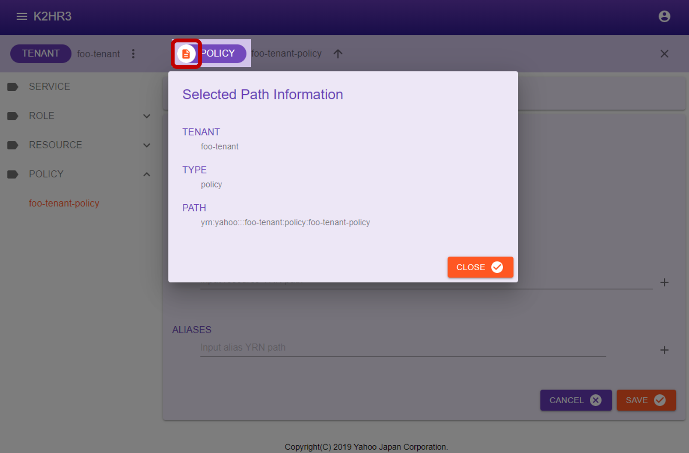

# POLICY-RULE Usage for K2HR3 Web Application
This section explains how to operate **POLICY-RULE** using the **K2HR3 Web Application**.

## Display of POLICY-RULE
If **POLICY-RULE** has not yet been registered in **TENANT**(when using the K2HR3 system for the first time), registration of **POLICY-RULE** is required first.  
If **POLICY-RULE** data already exists, you can check registered **POLICY-RULE** by selecting **POLICY-RULE** in the **left tree**.  

## Registering POLICY-RULE
To register POLICY-RULE, select **POLICY-RULE** in the **left tree**, then click the  button next to **[POLICY-RULE]** at the top.  
After clicking the button, a dialog for registering POLICY-RULE is displayed.  

Enter the **POLICY-RULE name** in the displayed dialog and click the  button to register POLICY-RULE.  

Items displayed in dialog and their contents are shown below.  
- TENANT  
The **TENANT name*** for registering POLICY-RULE is displayed.
- TYPE  
**"policy"** indicating that it is POLICY-RULE is displayed.
- PARENT PATH  
Always **"/"** is displayed.  
_Since POLICY-RULE can not be hierarchized, it always has this value._
- CREATE PATH  
Enter the name of the POLICY-RULE to be registered.

After registered **POLICY-RULE**, you can see by deploying **POLICY** in the left tree.  

## Editing of POLICY-RULE
To edit the contents of already registered **POLICY-RULE**, first select POLICY to edit in the left tree.  
After selection, the data of the **POLICY-RULE data** is displayed in the main area of **K2HR3 Web Application**.  

You can directly edit, add, or delete this POLICY-RULE data.  
After editing, you can save the POLICY-RULE data by clicking the  button.
To discard the editing, please click the  button.  

After selecting POLICY-RULE, the items displayed in the main area will be explained.  
- EFFECT  
The **EFFECT** on the type of access(**ACTION**) is displayed.  
**ALLOW** or **DENY** is selected.
- ACTION  
The type of access(**ACTION**) is displayed.  
Either **READ** or **WRITE** or both are selected.
- RESOURCES  
**[YRN](detail_various.html) full path** of RESOURCE registered in POLICY-RULE is listed.  
Also when editing/adding RESOURCE, enter **[YRN](detail_various.html) full path**.
- ALIAS  
The registered ALIAS is displayed.  
ALIAS is displayed as **[YRN](detail_various.html) full path** to other POLICY-RULE.  
To edit/add as well, enter **[YRN](detail_various.html) full path**.

## Attribute information of POLICY-RULE
To display **POLICY-RULE attribute information**, first select POLICY in the left tree.  
After selection, click  on the left side of **[POLICY]** to display the POLICY-RULE attribute information(**Selected Path Information**) dialog.  
The attribute information of POLICY-RULE is displayed in this dialog.  

The following describes attribute information of POLICY-RULE.
- TENANT  
Displays the **TENANT name** to which POLICY-RULE belongs.
- TYPE  
**"policy"** is displayed.
- PATH  
**[YRN](detail_various.html) full path** to this POLICY-RULE is displayed.  
This **[YRN](detail_various.html) full path** is used for input to **ROLE** and **POLICY-RULE ALIAS** etc.

