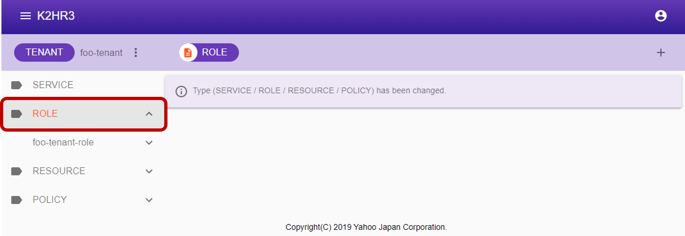

# ROLE Usage for K2HR3 Web Application
This section explains how to operate **ROLE** using the **K2HR3 Web Application**.

## Display of ROLE
If **ROLE** has not yet been registered in **TENANT**(when using the K2HR3 system for the first time), registration of **ROLE** is required first.  
If **ROLE** data already exists, you can check registered **ROLE** by selecting **ROLE** in the **left tree**.  

## Registering ROLE
To register ROLE, select **ROLE** in the **left tree**, then click the  button next to **[ROLE]** at the top.  
To register a **hierarchical ROLE**(ROLE with parent), select the **existing ROLE to be made a parent** from the left tree and click the button.  

After clicking the button, a dialog for registering ROLE is displayed.  

Enter the **ROLE name** in the displayed dialog and click the  button to register ROLE.  

Items displayed in dialog and their contents are shown below.  
- TENANT  
The **TENANT name** for registering ROLE is displayed.
- TYPE  
**"role"** indicating that it is ROLE is displayed.
- PARENT PATH  
**[YRN](detail_various.html) path** of the parent of ROLE to be registered is displayed.  
In the case of ROLE of top level(without parent) which is not layered, **"/"** is displayed.  
When registering under the parent ROLE, **[YRN](detail_various.html) path** of its parent ROLE is displayed.  
For example, if you register ROLE under the ROLE name **"toplevel"**, **"/toplevel"** is displayed.
- CREATE PATH  
Enter the name of the ROLE to be registered.

After registered **ROLE**, you can see by deploying **ROLE** in the left tree.

## Editing of ROLE
To edit the contents of already registered **ROLE**, first select ROLE to edit in the left tree.  
After selection, the data of the **ROLE data** is displayed in the main area of **K2HR3 Web Application**.  

You can directly edit, add, or delete this ROLE data.  
After editing, you can save the ROLE data by clicking the  button.
To discard the editing, please click the  button.  

After selecting ROLE, the items displayed in the main area will be explained.  
- HOST NAMES  
The HOST expressed by the **FQDN(hostname)** registered as a member of ROLE is enumerated.  
  - HOST NAME  
    The **FQDN**(hostname) is displayed.
  - AUX  
    Information set as [Auxiliary Information(AUX)](detail_various.html) is displayed.  
    For **AUX**, please see [Auxiliary Information (AUX)](detail_various.html).
- IP ADDRESSES  
The HOST expressed by the **IP address** registered as a member of ROLE is enumerated.  
  - IP ADDRESSE  
    The **IP address** is displayed.
  - AUX  
    Information set as [Auxiliary Information(AUX)](detail_various.html) is displayed.  
    For **AUX**, please see [Auxiliary Information (AUX)](detail_various.html).
- POLICIES  
**[YRN](detail_various.html) full path** of POLICY-RULE registered in ROLE is listed.  
Also when editing/adding POLICY-RULE, enter **[YRN](detail_various.html) full path**.
- ALIAS  
The registered ALIAS is displayed.  
ALIAS is displayed as **[YRN](detail_various.html) full path** to other ROLE.  
To edit/add as well, enter **[YRN](detail_various.html) full path**.

## Attribute information of ROLE
To display **ROLE attribute information**, first select ROLE in the left tree.  
After selection, click  on the left side of **[ROLE]** to display the ROLE attribute information(**Selected Path Information**) dialog.  
The attribute information of ROLE is displayed in this dialog.  

The following describes attribute information of ROLE.
- TENANT  
Displays the **TENANT name** to which ROLE belongs.
- TYPE  
**"role"** is displayed.
- PATH  
**[YRN](detail_various.html) full path** to this ROLE is displayed.  
This **[YRN](detail_various.html) full path** is used for input to **ROLE ALIAS** etc.
- ROLE TOKEN  
[ROLE TOKEN](api.html) for specifying ROLE is displayed.  
You can specify this TOKEN when using the [K2HR3 REST API](api.html).  
For details, please refer to [K2HR3 REST API](api.html).
- USER DATA SCRIPT  
This is text string of **USER DATA SCRIPT** to be specified at OpenStack instance(Virtual Machine) startup when the K2HR3 system is cooperate with and IaaS(OpenStack).  
**USER DATA SCRIPT** is used to register HOST automatically by IaaS(OpenStack).  
By clicking  button next to **"USER DATA SCRIPT"**, you can copy the character string of **USER DATA SCRIPT**.  
Please specify this **USER DATA SCRIPT** string when starting OpenStack instance(Virtual Machine).  
By specifying this **USER DATA SCRIPT** string and starting the instance(Virtual Machine), the **IP address of this HOST is automatically registered as this ROLE member**.  
The following figure shows the dialog for OpenStack's instance startup and shows the page that specifies **USER DATA SCRIPT**.  
_It depends on the version of OpenStack somewhat_  

