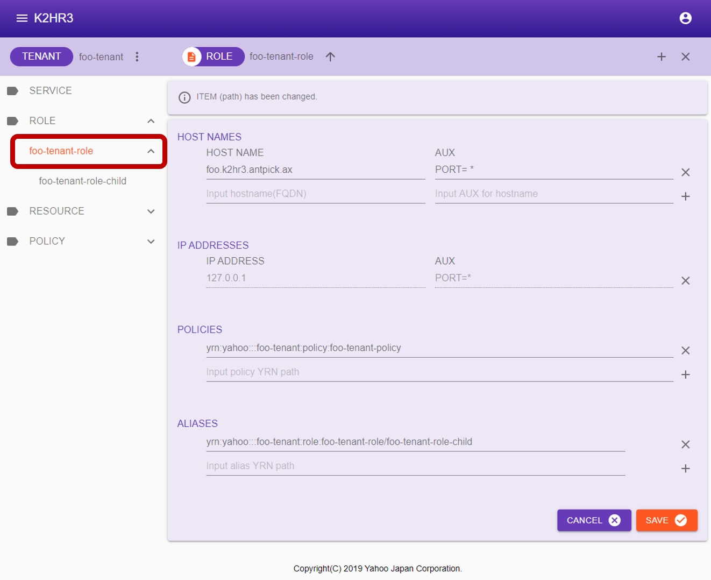
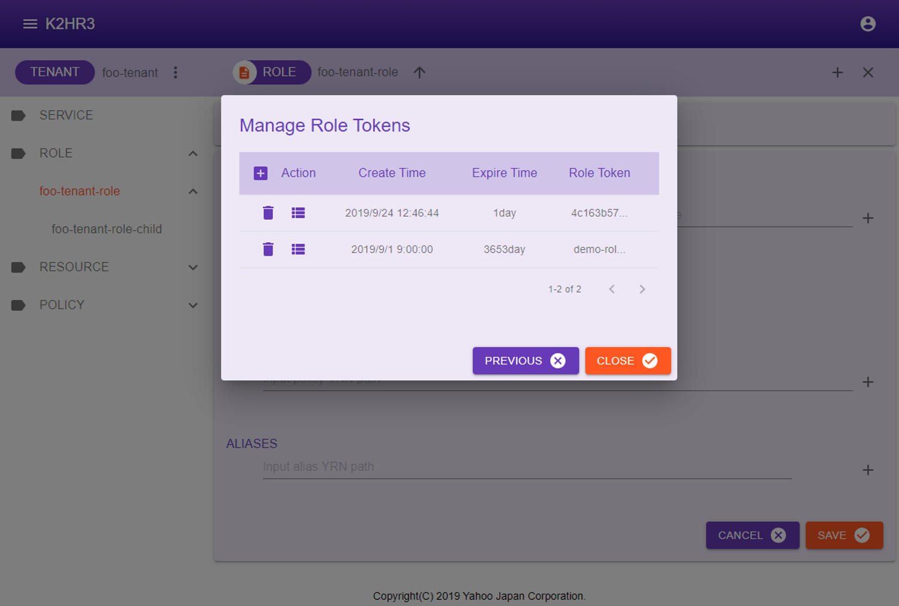
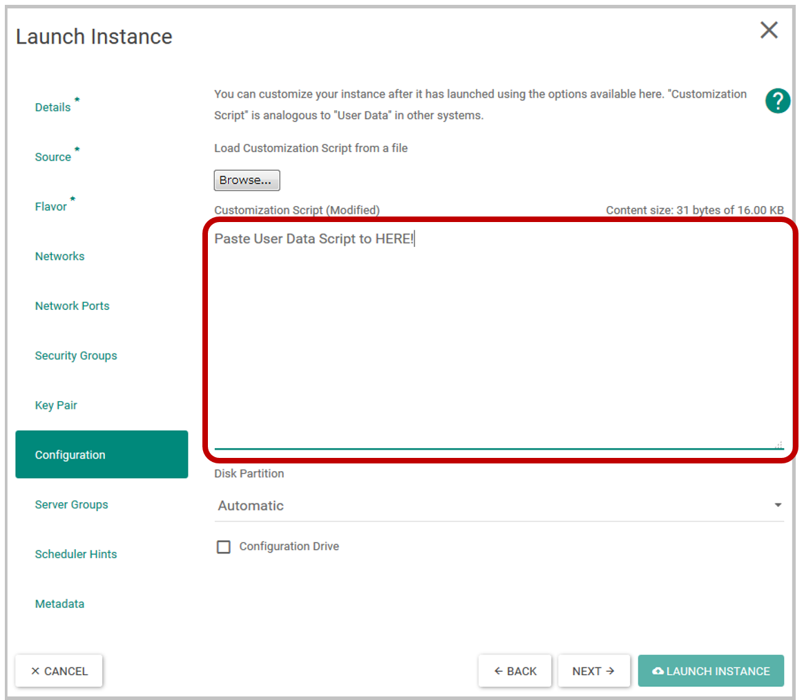

# ロール（ROLE）
K2HR3 Webアプリケーションでのロール（ROLE）操作の説明をします。

## ロール（ROLE）の表示
テナント（TENANT）にまだロール（ROLE）が登録されていない場合（初めてK2HR3システムを利用する場合など）、まずロール（ROLE）の登録が必要となります。  
すでにロール（ROLE）が存在する場合、左側ツリー表示の中の**ROLE**を選択することで、登録済みのロール（ROLE）を見ることができます。  


## ロール（ROLE）の登録
ロール（ROLE）を登録するには、左側ツリー中の**ROLE**を選択した後、上部の**[ROLE]**横の   ボタンをクリックします。  
_階層化したロール（ROLE）を登録する場合には、左側ツリーから親とする既存ロール（ROLE）を選択後、ボタンをクリックしてください。_  
ロール（ROLE）登録用のダイアログが表示されます。  


表示されたダイアログにロール（ROLE）名を入力し、   ボタンをクリックすれば、ロール（ROLE）が登録されます。  
ダイアログに表示される項目とその内容を以下に示します。  
- TENANT  
ロール（ROLE）を登録するテナント（TENANT）名が表示されます。
- TYPE  
ロール（ROLE）であることを示す**role**が表示されます。
- PARENT PATH  
登録するロール（ROLE）の親の**[YRN](detail_variousja.html)パス**が表示されます。  
階層化していないトップレベル（親を持たない）のロール（ROLE）の場合、**/**と表示されます。  
親ロール（ROLE）の下に登録する場合には、その親ロール（ROLE）の**[YRN](detail_variousja.html)パス**が表示されます。  
たとえば、ロール（ROLE）名 **toplevel** の下にロール（ROLE）を登録する場合、**/toplevel** と表示されます。
- CREATE PATH  
登録するロール（ROLE）名を入力します。

登録されたロール（ROLE）は、左側ツリーの**ROLE**を展開することで確認できます。  

## ロール（ROLE）の編集
登録されているロール（ROLE）の内容を編集するには、まず編集するロール（ROLE）を左側ツリーで選択します。  
選択後、メインの画面エリアにそのロール（ROLE）の情報が表示されます。  
この表示されている内容を編集、およびデータの追加をします。  
編集後は、   ボタンをクリックし、その内容を保存します。  
編集を破棄する場合は、   ボタンをクリックしてください。  



ロール（ROLE）選択後のメインの画面エリアに表示される項目について説明します。
- HOST NAMES  
ロール（ROLE）のメンバーとして登録されているFQDNで表現されたホスト（HOST）が列挙されます。  
  - HOST NAME  
    FQDNが表示されます。
  - AUX  
    付属情報として設定されている情報が表示されます。  
    詳しくは[付属情報（AUX）](detail_variousja.html)を参照してください。
- IP ADDRESSES  
ロール（ROLE）のメンバーとして登録されているIPアドレス表現されたホスト（HOST）が列挙されます。  
  - IP ADDRESSE  
    IPアドレスが表示されます。
  - AUX  
    付属情報として設定されている情報が表示されます。  
    詳しくは[付属情報（AUX）](detail_variousja.html)を参照してください。
- POLICIES  
登録されているポリシー/ルール（POLICY）の**[YRN](detail_variousja.html)フルパス**が列挙されます。  
編集・追加する場合にも、**[YRN](detail_variousja.html)フルパス**で入力します。
- ALIAS  
登録されているエリアス（ALIAS）が表示されます。  
エリアス（ALIAS）は他ロール（ROLE）への**[YRN](detail_variousja.html)フルパス**で表示されます。  
編集・追加する場合にも、**[YRN](detail_variousja.html)フルパス**で入力します。

## ロール（ROLE）の属性情報
登録されているロール（ROLE）の属性情報を表示するには、まずロール（ROLE）を左側ツリーで選択します。  
選択後、上部の**[ROLE]**左横の   をクリックし、ロール（ROLE）の属性情報（Selected Path Information）ダイアログを表示します。  
このダイアログに、ロール（ROLE）の属性情報が表示されます。  


ロール（ROLE）の属性情報について説明します。
- TENANT  
ロール（ROLE）が属しているテナント（TENANT）名を表示します。
- TYPE  
"role"と表示します。
- PATH  
このロール（ROLE）への**[YRN](detail_variousja.html)フルパス**を表示します。  
この**[YRN](detail_variousja.html)フルパス**は、ロール（ROLE）のエリアス（ALIAS）等の設定を行うときに使います。
- ROLE TOKEN  
ロール（ROLE）のトークンの管理・操作、およびIaaS（OpenStack、kubernetes）への自動登録のための情報を表示するためのボタン が表示されます。  
ロールトークンの管理をする場合には、 **ロールトークンの管理** ボタンをクリックします。  
新規ロールトークンを作成し、そのロール（ROLE）トークンの詳細およびIaaS（OpenStack、kubernetes）への自動登録用コードの情報を表示するには、 **ロールトークン新規作成（有効期限付き）・登録用コード表示** ボタンをクリックします。  

### ロール（ROLE）トークンの管理
ロール（ROLE）の属性情報（Selected Path Information）ダイアログから、 **ロールトークンの管理** ボタンをクリックすることで、ロール（ROLE）トークンの管理ができます。  
以下に示すロール（ROLE）トークンの管理画面にて、対象のロール（ROLE）に対して発行済みのロール（ROLE）トークンの一覧を確認することができます。  



この画面には、新規ロール（ROLE）トークン発行ボタン 、ロール（ROLE）トークン削除ボタン 、IaaS（OpenStack、kubernetes）への自動登録用コードの表示ボタン  があります。  
それぞれのボタンの動作を以下にしめします。

#### 新規ロール（ROLE）トークン発行
新規ロール（ROLE）トークン発行ボタン をクリックすることで、新規にロール（ROLE）トークンを発行することができます。  
新規に発行されるロール（ROLE）トークンは、有効期限（デフォルト24時間）もしくは無期限（10年）のいずれかを指定することができます。  
_有効期限の設定は、K2HR3 Web Applicationのconfigで設定することができます。_  
このボタンをクリックすると以下に示すポップアップが表示されます。  


このポップアップのボタンをクリックすると新規ロール（ROLE）トークンが作成されます。  
_新規作成された直後、作成されたロール（ROLE）トークンは、ロール（ROLE）トークンの管理画面の先頭に太字で表示されます。_  

#### ロール（ROLE）トークン削除
削除するロール（ROLE）トークンの列にある ボタンをクリックすることで、そのロール（ROLE）トークンを削除（無効）にすることができます。

#### ロール（ROLE）トークンの詳細および自動登録用コードの表示
利用するロール（ROLE）トークンの列にある ボタンをクリックすることで、後述するロール（ROLE）トークンの詳細およびIaaS（OpenStack、kubernetes）への自動登録用コードの情報を表示する画面に遷移します。

### ロール（ROLE）トークンの詳細および自動登録用コードの表示
ロール（ROLE）の属性情報（Selected Path Information）ダイアログから、 **ロールトークン新規作成（有効期限付き）・登録用コード表示** ボタンをクリックするか、ロール（ROLE）トークンの管理画面からボタンをクリックするとこの画面に遷移します。  


この画面には、以下の項目が表示されています。  

#### ロール（ROLE）トークン
ロール（ROLE）トークンが表示されます。（全文字列が表示されます。）  
[K2HR3 REST API](apija.html)を使うときにこの[トークン](apija.html)を指定します。  
詳細は、[K2HR3 REST API](apija.html)を参照してください。

#### 作成日時(有効期限)
ロール（ROLE）トークンが作成された日時と、その有効期限が表示されます。

#### 登録用コード
このロール（ROLE）トークンを使用したIaaS（OpenStack、kubernetes）への自動登録用コードの情報、およびユーザ定義のCustom Registration Code（CRC）の内容を表示します。  
組み込みの表示する自動登録用コードは、IaaS（OpenStack、kubernetes）に応じて以下の種類があります。  


- User Data Script for OpenStack  
OpenStackの仮想コンピューティング（Virtual Machine）を自動登録するための**USER DATA SCRIPT**を表示します。  
この利用方法は、後述します。
- Secret Yaml for kubernetes  
kubernetesのPods（Containers）を自動登録する場合、K2HR3システムはkubernetesに対して**Secret**の登録を必要とします。  
この**Secret**を登録するためのテンプレートとなる**Yaml**を表示します。  
このYamlを環境に合わせて加工し、**Secret**を登録してください。  
この利用方法は、後述します。
- Sidecar Yaml for kubernetes  
kubernetesのPods（Containers）を自動登録する場合、K2HR3システムはPodsにK2HR3専用の軽量の**Sidecar**を立ち上げます。  
この**Sidecar**を登録するためのテンプレートとなる**Yaml**を表示します。  
このYamlを環境に合わせて加工し、**Sidecar**を起動してください。  
この利用方法は、後述します。

上記に加えて、Custom Registration Code（CRC）を設定している場合、すべてのCustom Registration Code（CRC）の設定内容（複数）が同様に表示されます。

### OpenStack - USER DATA SCRIPTの使い方
OpenStackの仮想コンピューティング（Virtual Machine）をロール（ROLE）のメンバーとして自動登録する方法を説明します。  
前述のロール（ROLE）トークンの自動登録用コードの表示にて、**User Data Script for OpenStack** を選択することで、**USER DATA SCRIPT**を表示することができます。  
この **USER DATA SCRIPT** は、クリップボードにコピー ボタンで、コピーすることができます。  

表示された**USER DATA SCRIPT**を、OpenStackの仮想コンピューティング（Virtual Machine）を起動するときに指定してください。  
これにより、自動的に仮想コンピューティング（Virtual Machine）が起動したらそのホスト（HOST）のIPアドレスが、このロール（ROLE）のメンバーとして登録されます。  
以下は、OpenStackの**USER DATA SCRIPT**を指定するダイアログです。（バージョンにより多少異なります）  



### kubernetes - Yamlテンプレートの使い方
kubernetesのPods（Containers）をロール（ROLE）のメンバーとして自動登録する方法を説明します。  
前述のロール（ROLE）トークンの自動登録用コードの表示にて、**Secret Yaml for kubernetes** および **Sidecar Yaml for kubernetes** を選択し、それぞれの内容をコピーします。
これらのYamlは、クリップボードにコピー ボタンで、コピーすることができます。  

#### Secret Yaml
**Secret Yaml for kubernetes**で表示されるコードは、kubernetesに **k2hr3-secret** を **Secret** として登録するためのサンプル（テンプレート）コードです。  
K2HR3システムでは、kubernetes の **Secret** にロール（ROLE）トークンを保管します。  
以下のようなコードがコピーされますので、お使いの環境に合わせて、**namespace** などを編集し、kubectlなどを使い、**Secret** を登録してください。  
```
apiVersion: v1
kind: Secret
metadata:
  name: k2hr3-secret
  namespace: <input your name space>
type: Opaque
data:
  K2HR3_ROLETOKEN: ****************************************************
```
以下は、**Secret**を登録するコマンドの例です。
```
$ kubectl create --save-config -f secret.yaml
```

#### Sidecar Yaml
**Sidecar Yaml for kubernetes**で表示されるコードは、kubernetesに Pods（Containers）を起動する場合に、一緒に起動するK2HR3専用の**Sidecar**のサンプル（テンプレート）コードです。  
K2HR3専用の**Sidecar**は、**k2hr3-volume**という**volume**を使い、**k2hr3-sidecar**という**container**を起動します。  
このサンプル（テンプレート）コードを、環境に合わせて編集し、組み込んだYamlファイルを使って、Pods（Conatiners）を起動してください。  
サンプル（テンプレート）コードには、必要最小限のK2HR3専用**Sidecar**のコードが記述されています。  
K2HR3専用の**Sidecar**は、**docker.io/antpickax/k2hr3.sidecar**イメージを使います。  

K2HR3専用の**Secret**登録と**Sidecar**の起動ができれば、自動的にkubernetesのPods（Containers）がこのロール（ROLE）のメンバーとして登録されます。
