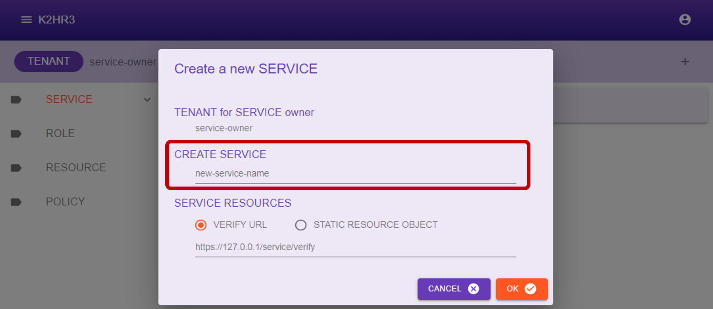
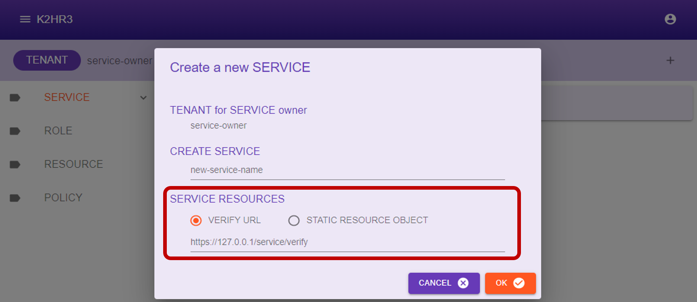
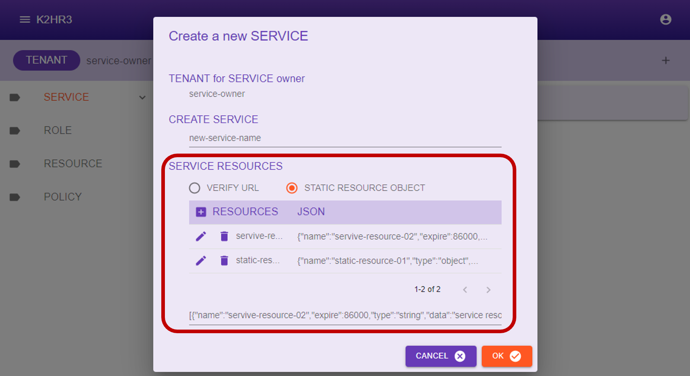
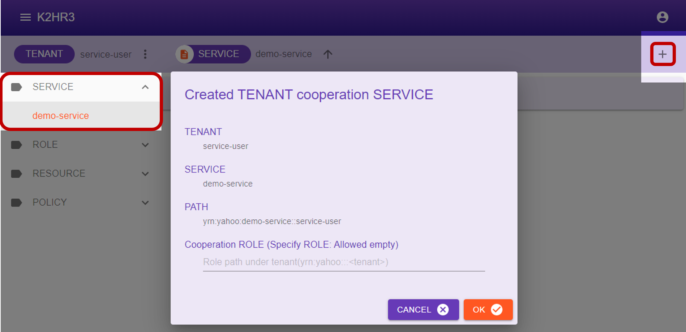
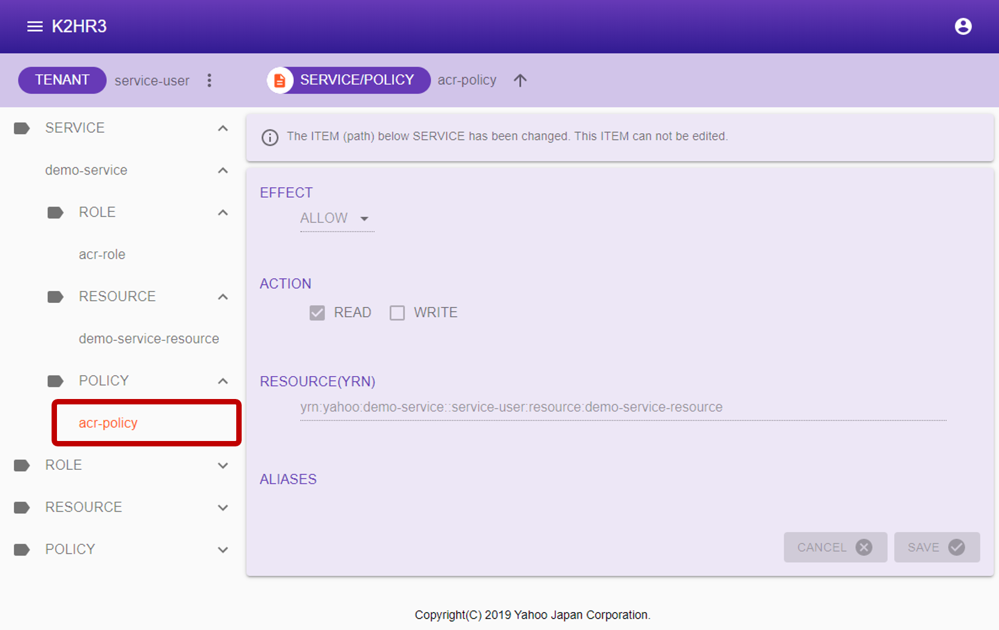

# SERVICE Usage for K2HR3 Web Application
This section explains how to operate **SERVICE** using the **K2HR3 Web Application**.

## Display of SERVICE
If **SERVICE** has not yet been registered in **TENANT**(when using the K2HR3 system for the first time), registration of **SERVICE** is required first.  
If **SERVICE** data already exists, it is displayed your registered **SERVICE** in in the **left tree** by selecting **[SERVICE] item**.  

### Display of SERVICE OWNER

### Display of SERVICE MEMBER

## Registering SERVICE by OWNER
Register SERVICE for OWNER side providing RESOURCE.
You can register new SERVICE for OWNER by you click the  button next to **[SERVICE]** at the top after selecting **[SERVICE] item** in the **left tree**.  

After clicking the button, a dialog for registering SERVICE is displayed.  

Enter the **SERVICE name** and the **RESOURCE** provided by **SERVICE** in the displayed dialog and click the  button to register **SERVICE**.  
You can register **static RESOURCE** or **dynamic RESOURCE** (VERIFY URL) to SERVICE's **RESOURCE**.  

After clicking the button, a dialog for registering SERVICE is displayed.  

### TENANT for SERVICE owner  
The **TENANT name** for registering SERVICE **OWNER** is displayed.

### CREATE SERVICE
Enter the name of the SERVICE to be registered.

### SERVICE RESOURCES  
Enter the RESOURCE data of the SERVICE.  
When registering a **static RESOURCE**, select **STATIC RESOURCE OBJECT**.  
When registering a **dynamic RESOURCE**, specify the **VERIFY URL**.  
Depending on the selection of SERVICE RESOURCES, the input operation will differ as described below.

#### dynamic RESOURCE(VERIFY URL)
When **VERIFY URL** is selected, the following parts are displayed in the dialog.  
  
Enter **URL** in the text input area.  
This **VERIFY URL** is the URL to the REST API prepared by the SERVICE OWNER.

#### static RESOURCE
When **STATIC RESOURCE OBJECT** is selected, the following parts are displayed in the dialog.  
  

A **static RESOURCE** can describe multiple normal RESOURCE.  
In the above dialog, the resources to be registered RESOURCE are listed and displayed.  

To add a new RESOURCE, click Add new RESOURCE button .  
Click RESOUCE edit button  to edit the registered RESOURCE.  
When registering and editing a new RESOURCE, move to the screen(dialog) described later and edit it individually.  
To delete the registered RESOURCE, click the RESOUCE edit button .  

How to register the contents of JSON string for RESOURCE, please refer to [**+SERVICE Usage**](usage_service.html).  

### dialog for RESOURCE new creation and edit
After selecting a **static RESOURCE**, when editing each RESOURCE or creating a new RESOURCE, the following screen will appear.  
  

On this screen, enter individual RESOURCE elements.  
Input items are the same as normal RESOURCE, and the following items can be input.
- STATIC RESOURCE NAME  
Please enter a name for this RESOURCE.  
A static RESOURCE can have multiple RESOURCEs, so specify a unique name.  
When cooperating with SERVICE MEMBER, these RESOURCEs are deployed to SERVICE MEMBER.
- Valid period(Second: Unset is allowed)  
When cooperating with SERVICE MEMBER, you can specify the expiration date of this RESOURCE.  
Specify the expiration date after cooperating in seconds.  
If not specified, it will never expire(default).
- KEYS(Key Value)  
You can specify multiple combinations of KEY and VALUE for this RESOURCE.

## Editing of SERVICE by OWNER
SERVICE registered as OWNER can be confirmed by expanding **SERVICE** in the **left tree**.  
OWNER's SERVICE item in left tree has the  **icon** is displayed next to its  name.  

OWNER can edit the contents of registered SERVICE.  
First, you need to select SERVICE name under [SERVICE] item in left tree for editing the contents of already registered **SERVICE**.  
After selection, the data of the **SERVICE** is displayed in the main area of **K2HR3 Web Application**.  

You can directly edit, add, or delete this SERVICE data in main area.  
After editing, you can save the SERVICE data by clicking the  button.  
You click the  button for discarding the modified data.  

After selecting SERVICE name, the following items displayed in the main area.  

### SERVICE RESOURCES  
SERVICE RESOURCE is displayed.  
**Static RESOURCE** and **dynamic RESOURCE** (VERIFY URL) are selected.  
The above image is a case of SERVICE RESOURCE with VERIFY URL selected as dynamic RESOURCE.  
When static RESOURCE is selected, the following screen is displayed.  

The operations on these screens are the same as the SERVICE registration dialog described above.

### TENANTS  
TENANT registered as MEMBER of SERVICE is enumerated in this item.  
You can add and delete MEMBER's TENANT.  
You need to specify MEMBER's TENANT with **[YRN](detail_various.html) full path**.  

## To cooperate with OWNER's SERVICE
This operation allows that MEMBER's TENANT to cooperate with OWNER'S SERVICE.  
MEMBER needs to get be allowed their TENANT by OWNER to start cooperating with OWNER's SERVICE.  

For cooperating with OWNER's SERVICE, USER of MEMBER selects SERVICE name which is displayed without  **icon** in the left tree.  
You can find MEMBER's SERVICE name which is allowed cooperating with OWNER's SERVICE under  **[SERVICE] item** in the left tree.  
_MEMBER's SERVICE name is as same as OWNER's SERVICE name_  
And you can select it to start cooperating with OWNER's SERVICE.   
After selecting it, you click the  button next to **[SERVICE] <service name>** at the top.  

After this click, a dialog for SERVICE cooperation will be displayed.  

If you click the  button in the displayed dialog, it starts that MEMBER's SERVICE cooperates with OWNER's SERVICE.  
You can specify one ROLE name as an initial ROLE which controls member HOSTs for SERVICE before clicking  button on dialog.  

Following Items displayed in this dialog and their contents are shown below.  
- TENANT  
Displays the name of the TENANT that cooperates with the OWNER's SERVICE.
- SERVICE  
The SERVICE name is displayed.  
_This name is as same as OWNER's SERVICE name_
- PATH  
This is **[YRN](detail_various.html) full path** to MEMBER's SERVICE after cooperating.  
This **[YRN](detail_various.html) full path** is a path that contains **MEMBER's TENANT**, thus it means this is used to specify the SERVICE for only this MEMBER.
- ROLE(to be registered at cooperation)  
You can input the **[YRN](detail_various.html) full path** of ROLE  which controls member HOSTs for MEMBER's SERVICE at starting cooperation.  
This item is allowed empty value for not register the ROLE at starting cooperation, and you can set the ROLE after cooperation.

SERVICE registered as MEMBER can be confirmed by expanding **SERVICE** in the **left tree**.  
MEMBER's SERVICE item in left tree does not have the  **icon** on its  name.  

## Contents of MEMBER's SERVICE
MEMBER's SERVICE cooperated with OWNER's SERVICE is displayed on the left tree.  
After selecting MEMBER's SERVICE name under [SERVICE] item in left tree, it is displayed subitems which are **ROLE**, **POLICY-RULE**, **RESOURCE** in MEMBER's SERVICE name item.  

The contents of each subitems are explained below.

### ROLE in MEMBER's SERVICE
This ROLE subitem has only **"acr-role"**.  
After selecting **"acr-role"**, the contents of this is displayed in main area.  
This **"acr-role"** has  only **[YRN](detail_various.html) full path** of **"acr-policy"** as POLICY-RULE.  
_The contents of this ROLE can not be edited._  

### POLICY-RULE in MEMBER's SERVICE
This POLICY-RULE subitem has only **"acr-policy"**.  
After selecting **"acr-policy"**, the contents of this is displayed in main area.  
This **"acr-policy"** has  **EFFECT**, **ACTION** and **RESOURCES** which is provided by OWNER's SERVICE.  
**RESOURCES** has enumerated *[YRN](detail_various.html) full path** of all RESOURCEs which are provided by OWNER's SERVICE.  

_The contents of this POLICY-RULE can not be edited._  

### RESOURCE in MEMBER's SERVICE
This RESOURCE subitem is listed all RESOURCEs which are provided by OWNER's SERVICE.  
After selecting each RESOURCE name, the contents of it is displayed in main area.  
Each RESOURCE is registered static or dynamic RESOURCE set by OWNER to SERVICE.  
_This contents of all RESOURCEs can not be edited._  

## ROLEs associated of MEMBER's SERVICE
MEMBER's SERVICE has ROLEs associated of MEMBER's SERVICE to cooperate with OWNER's SERVICE.  
This ROLE is not special for SERVICE feature, is as same as normal ROLE.  
Then the ROLE which is associated of SERVICE is listed under [ROLE] top item in left tree.  
_If you select the ROLE, the contents of ROLE is displayed in main area._  
The contents of ROLEs associated of MEMBER's SERVICE has at least one ALIAS which is **[YRN](detail_various.html) full path** to **"acr-role"**.  
In other words, the ROLE associated of MEMBER's SERVICE must have ALIAS to **"acr-role"** ROLE.  
Thus the ROLE which has ALIAS to **"acr-role"** is associated of MEMBER's SERVICE.  

If you want to add the ROLE of MEMBER's SERVICE, you can add **"acr-role"** to ALIAS in that ROLE.  

### How to associate ROLE to SERVICE
In order to use OWNER's SERVICE from MEMBER system, MEMBER's ROLE which is registered MEMBER system's HOST is required to associated in MEMBER's SERVICE.  
Its ROLE must have  **[YRN](detail_various.html) full path** to **"acr-role"** in ALIAS.  
For associating to MEMBER's SERVICE, you can register **"acr-role"** to these ROLE anytime.  
Thus just register it and the cooperating with OWNER's SERVICE will be completed.  

### How to remove ROLE from SERVICE
How to remove the ROLE which is associated to MEMBER's SERVICE is as same as adding it.  
It is only deleting **"acr-role"** in ALIAS from the ROLE.  
Just delete it and it will be completed.  

## Attribute information of SERVICE
To display OWNER's and MEMBER's **SERVICE attribute information**, first select SERVICE in the left tree.  
_The way to displaying attribute information for both OWNER and MEMBER is the same._  
After selection, click  on the left side of **[SERVICE]** to display the SERVICE attribute information(**Selected Path Information**) dialog.  
The attribute information of SERVICE is displayed in this dialog.  

The following list describes attribute information of SERVICE.
- TENANT  
Displays the TENANT name to which SERVICE belongs.  
Even though it is the same SERVICE, TENANT belonging to OWNER and interest MEMBER is **different**.  
This TENANT name indicates the TENANT of OWNER or MEMBER to which SERVICE belongs.
- SERVICE  
Displays the SERVICE name.  
This value is the same for OWNER and MEMBER.
- TYPE  
**"service"** is displayed.
- PATH  
**[YRN](detail_various.html) full path** to this SERVICE is displayed.  
This value is the same **[YRN](detail_various.html) full path** for both OWNER and MEMBER.

