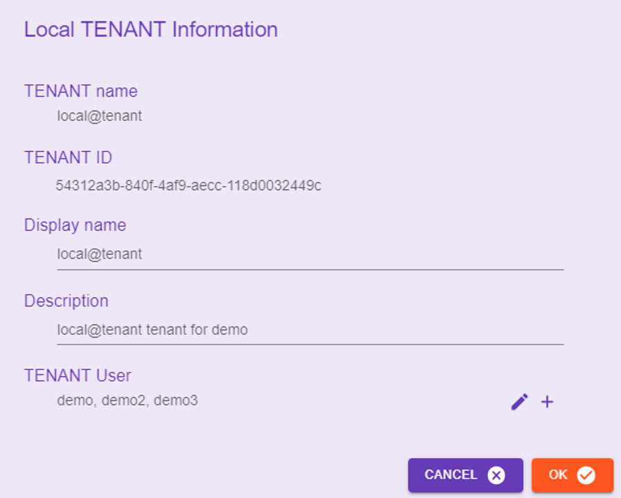

# TENANT Usage for K2HR3 Web Application
This section explains how to operate **TENANT** using the **K2HR3 Web Application**.

### About TENANT
The K2HR3 system can operate in conjunction with **OpenStack** or other any **user authentication systems**.  
When cooperated with OpenStack, the K2HR3 **TENANT** refers to the tenant(or project) to which the USER belongs in OpenStack.  
When cooperated with Kubernetes, the K2HR3 **TENANT** refers to the Namespace to which the USER belongs in Kubernetes.  
In addition to this, a **LOCAL TENANT** can be created and used within the K2HR3 system.  
When using other user authentication system, it refers to the **group**(scoped group) to which the USER belongs in that authentication system.

# Selection of TENANT
After signing in with the **K2HR3 Web Application**, the following screen will be displayed.  


In order to operate data of **RESOURCE**, **POLICY-RULE**, **ROLE**, **SERVICE**, please select **TENANT** to which these data to operate belong.  

You can select **TENANT** by the following procedure.  
1. Click  next to the button **[TENANT] Unselected** to select TENANT.
1. A list of TENANTs to which the USER you are signed in belongs to is displayed.
1. Select one TENANT.


When **TENANT** is selected, the information of **RESOURCE**, **POLICY-RULE**(display as POLICY), **ROLE**, **SERVICE** registered in the **TENANT** is displayed in left side tree and can be used.  


## About LOCAL TENANT
The K2HR3 system can use LOCAL TENANT other than TENANT provided by the linked IaaS(OpenStack or Kubernetes).  
Please see below for how to create, edit and delete this LOCAL TENANT.  

### Setting for using LOCAL TENANT
Server settings for K2HR3 Web Application and K2HR3 REST API are required to use LOCAL TENANT.  
Set the following values to `true` in each server setting(in configuration).  
_The default is `true`, so set `false` only when not using LOCAL TENANT._  

- K2HR3 Web Application（例：config/default.json）  
```
{
    ...
    'uselocaltenant': true,
    ...
}
```

- K2HR3 REST API（例：config/default.json）  
```
{
    ...
    'localtenants': true,
    ...
}
```

### Create LOCAL TENANT
LOCAL TENANT can be freely created.  
Select the ** Create Local Tenant ** menu on the last line of the tenant selection menu.  


#### Create LOCAL TENANT Dialog
Below is the dialog for creating a new LOCAL TENANT.  


Enter the required items in this dialog and click the **OK** button to create the LOCAL TENANT.  
Each input item is described below:  

##### TENANT name
Enter the name of the LOCAL TENANT.  
This value cannot overlap with any other TENANT name.  
LOCAL TENANT names must start with the ** local@ ** prefix.  
If the ** local@ ** prefix is not specified, it will be automatically added.  

##### Display name
Specify the string when displaying LOCAL TENANT on K2HR3 Web Application.  
This value can be omitted, and if omitted, it will be the same as the LOCAL TENANT name.  

##### Description
Enter a description for the LOCAL TENANT.  
This value is optional.  

##### TENANT User
Specify a USER who can access the LOCAL TENANT.  
USERs can be added/deleted using the buttons in this dialog.  
When creating a new one, your own name is automatically added and you cannot delete yourself.  

### Edit LOCAL TENANT
This dialog can edit LOCAL TENANT information.  

With LOCAL TENANT selected, click the edit button next to the TENANT name.  


#### Edit LOCAL TENANT Dialog
Below is the dialog for editing a existed LOCAL TENANT.  



You can edit each item in this dialog.  
You can also delete LOCAL TENANTs from this dialog.  

##### TENANT name
This field cannot be edited.  

##### TENANT ID
This field cannot be edited.  

##### Display name
Specify the string when displaying LOCAL TENANT on K2HR3 Web Application.  
If this value is empty, it will be the same as the LOCAL TENANT name.  

##### Description
Enter a description for the LOCAL TENANT.  
This value can be empty.  

##### TENANT User
You can add/edit/delete users who can access LOCAL TENANT.  
If you delete your own USER name, you will not be able to access this LOCAL TENANT.  
If you delete all USERs, the LOCAL TENANT will be completely deleted.  

### Delete LOCAL TENANT
Delete a LOCAL TENANT in the Edit LOCAL TENANT Dialog.  

Start the Edit LOCAL TENANT Dialog and delete all LOCAL TENANT USERs.  
This operation will completely remove the LOCAL TENANT.  
