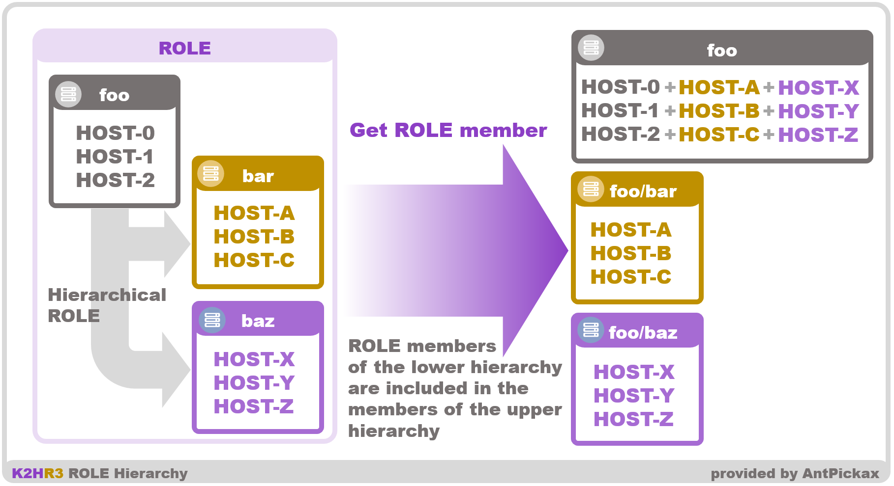

# 基本的な使い方
K2HR3システムを利用するときの基本的な設定・操作の流れを説明します。  
ここでは、基本となるリソース（RESOURCE）、ポリシー/ルール（POLICY）、ロール（ROLE）の設定を一連の流れとして説明します。  
以下の手順を基本として、K2HR3をご利用ください。

# (1) リソース（RESOURCE）の定義・単位・設定
K2HR3システムを利用する目的は、リソース（RESOURCE）に対してロール（ROLE）ベースでアクセス制御を行うことです。  
つまり、**RBAC**（**R**ole **B**ased **A**ccess **C**ontrol）の対象であるリソース（RESOURCE）の定義・登録から開始します。  

## リソースの定義・単位
ユーザ（USER）の環境で、**RBAC**（**R**ole **B**ased **A**ccess **C**ontrol）の対象としてのリソース（RESOURCE）を見出します。  
このリソース（RESOURCE）とは、アクセス元（ロール（ROLE）メンバーのホスト（HOST））により異なるデータなどを指標にすると抽出が簡単です。  
たとえば、以下のようなデータをリソース（RESOURCE）として定義できます。
- アプリケーションやプログラムの設定ファイル
- URLリストなど
- 同じ機能を提供するホスト名リスト（Webサーバーなど）

次に、リソース（RESOURCE）の大まかな単位を以下を参考にして考えます。
- ロール（ROLE）単位でアクセスされるデータ
- 他のリソース（RESOURCE）で流用できるデータ
- 動的、静的なデータ
- アクセス種別に応じたデータ

まずは、以下の内容を確認して、作成するリソース（RESOURCE）の定義と単位を設計してください。

## リソースの内容
リソース（RESOURCE）に設定できるデータは、以下のいずれか、もしくはそれらの組み合わせを設定することができます。  

### 文字列もしくはJSONオブジェクト（文字列）
リソース（RESOURCE）には、文字列かJSONオブジェクト（文字列）の種別を選択して、データを設定できます。  
JSONオブジェクトの場合は、文字列で表現されたJSONオブジェクトを設定します。  
文字列の場合には、任意の文字列として設定できます。  
また、文字列の場合にはK2HR3で利用できる**テンプレート（TEMPLATE）**で記述することができます。  
テンプレート（TEMPLATE）については、[K2HR3テンプレートエンジン](usage_templateja.html)を参照してください。  

### キーと値
リソース（RESOURCE）には、キーと値（KeyValue）として、任意のキー名と、値をセットで設定することができます。  
このキーと値のセットは複数設定できます。  

### エリアス（ALIAS）
リソース（RESOURCE）には、他のリソース（RESOURCE）をエリアス（ALIAS）としてインクルードできます。  
エリアス（ALIAS）に指定されたリソース（RESOURCE）の内容全てを、エリアス（ALIAS）を指定したリソース（RESOURCE）に取り込むことができ、リソース（RESOURCE）の内容を合成できます。  
これにより、REST APIを通してリソース（RESOURCE）を取得するとき、分割管理されているリソース（RESOURCE）の内容を合成して取得できるようになります。  
エリアス（ALIAS）を使い、リソース（RESOURCE）を細分化・グループ化して分割し、管理を簡単にできます。

## リソース（RESOURCE）の単位
リソース（RESOURCE）は、最小の単位で設定することを推奨します。  
これは、リソース（RESOURCE）データは、上述のエリアス（ALIAS）や後述の階層化することにより、自身で定義した以外の他リソース（RESOURCE）のデータを含むことができるため、最小単位で作成し、それらをまとめて（集約）して利用することができるためです。  
このように集約できるため、値の変化するタイミングでの区分、グルーピングなどで単位化、分割することにより、管理・運用を軽減できます。  
また、リソース（RESOURCE）を最小単位で構成し、それらを集約して利用することで、柔軟なリソース（RESOURCE）のパターンを作成することができます。  

### リソース（RESOURCE）の階層化
リソース（RESOURCE）名は、PATH形式（`/`文字により連結されます）で表現することもでき、ディレクトリのように階層化した構造を作り出せます。  

### 階層化したリソース（RESOURCE）の継承
階層化したリソース（RESOURCE）は、上位層のリソース（RESOURCE）が下位層のリソース（RESOURCE）に取り込まれ、リソース（RESOURCE）データが継承されます。  
つまり、上位階層で設定されたリソース（RESOURCE）の値は、下位のリソース（RESOURCE）に含まれており、下位のリソース（RESOURCE）を取得したときにデータに含まれます。  
これにより、共通のリソース（RESOURCE）を階層化した上位層に設定することで、リソース（RESOURCE）データを共有し、複数の異なるデータを作り出すことができます。  

## リソース（RESOURCE）の設定
リソース（RESOURCE）の定義・単位を決めたら、次はその単位を階層を考慮しながらリソース（RESOURCE）として登録します。  

#### (1-1) テナント（TENANT）を選択
#### (1-2) テナント（TENANT）にリソース（RESOURCE）を追加
#### (1-3) リソース（RESOURCE）の内容（データ）を設定

# (2) ポリシー/ルール（POLICY）の定義・設定
リソース（RESOURCE）の登録が終わったら、それらリソース（RESOURCE）に対してアクセス方法をポリシー/ルール（POLICY）として登録します。  
ポリシー/ルール（POLICY）は、利用されるリソース（RESOURCE）の単位で登録します。  

## ポリシー/ルール（POLICY）の内容
ポリシー/ルール（POLICY）で設定する項目を以下に示します。

### 効果（EFFECT）
設定するアクセス方法（ACTION）に対する以下の効果（EFFECT）を選択します。  
- 許可（ALLOW）
- 禁止（DENY）

### アクセス方法（ACTION）
リソース（RESOURCE）に対して以下のアクセス方法（ACTION）を組み合わせて定義します。  
- 読み出し（READ）
- 書き込み（WRITE）
- 実行（EXECUTE）  
_現在まだ提供されていません。_

### リソース（RESOURCES）
このポリシー/ルール（POLICY）で制御するリソース（RESOURCE）を一つもしくは複数指定します。  
リソース（RESOURCE）は、**[YRN](detail_variousja.html)フルパス** で指定してください。  
**[YRN](detail_variousja.html)フルパス** は、該当するそのリソース（RESOURCE）を示す一意のPATHであり、[K2HR3 Web Application](usage_appja.html)の場合はリソース（RESOURCE）を選択し、そのリソース（RESOURCE）の **Selected Path Information** を表示させることで調べることができます。  

ここで設定したリソース（RESOURCE）へのアクセスをする際、このポリシー/ルール（POLICY）が適応された場合に、アクセス方法（ACTION）、効果（EFFECT）と照らしあわしてアクセスが判定されます。  

### エリアス（ALIAS）
ポリシー/ルール（POLICY）には、他のポリシー/ルール（POLICY）をエリアス（ALIAS）としてインクルードできます。  
エリアス（ALIAS）に指定されたポリシー/ルール（POLICY）の内容全てを、エリアス（ALIAS）を指定したポリシー/ルール（POLICY）に取り込むことができ、ポリシー/ルール（POLICY）の内容を合成できます。  
これにより、ポリシー/ルール（POLICY）を適用するとき、分割管理されているポリシー/ルール（POLICY）内容を合成した結果を使って、適用できるようになります。  
エリアス（ALIAS）を使い、ポリシー/ルール（POLICY）を細分化・グループ化して分割し、管理を簡単にできます。

## ポリシー/ルール（POLICY）の設定
ポリシー/ルール（POLICY）の定義を決めたら、その定義に従ってポリシー/ルール（POLICY）を登録します。  

#### (2-1) テナント（TENANT）を選択
#### (2-2) テナント（TENANT）にポリシー/ルール（POLICY）を追加
#### (2-3) ポリシー/ルール（POLICY）に内容（データ）を設定

# (3) ロール（ROLE）の定義・設定
次は、リソース（RESOURCE）に対してアクセスする単位でロール（ROLE）を定義します。  
ロール（ROLE）は、利用するリソース（RESOURCE）と、それに対するポリシー/ルール（POLICY）の単位で定義します。  

## ロール（ROLE）の内容
ロール（ROLE）で設定する項目を以下に示します。

### ホスト名（HOST NAMES）
ロール（ROLE）に登録するホスト（HOST）をホスト名で区別する場合に、手動で登録します。  
ホスト名（FQDN）とそのホストの付属情報（AUX）を一緒に登録します。  
_詳細は[付属情報（AUX）](detail_variousja.html)を参照してください。_

### IPアドレス（IP ADDRESSES）
ロール（ROLE）に登録するホスト（HOST）をIPアドレスで登録します。  
IPアドレスとそのホストの付属情報（AUX）を一緒に登録します。  
_詳細は[付属情報（AUX）](detail_variousja.html)を参照してください。_

#### 補足
IaaS（OpenStackもしくはkubernetes）と連携したロール（ROLE）メンバーの自動登録・削除を行う場合、手動によるIPアドレスでのホスト（HOST）登録は **不要** です。  
連携をしている場合、IPアドレスは自動で登録・削除が行われるためです。  
自動登録・削除以外で登録が必要となる場合（OpenStack以外の実機の場合など）に利用してください。

### ポリシー（POLICIES）
登録するロール（ROLE）のメンバーがアクセスするリソース（RESOURCE）へのアクセスを定義したポリシー/ルール（POLICY）を列挙してください。  
複数のポリシー/ルール（POLICY）を登録することができます。  

### エリアス（ALIAS）
ロール（ROLE）には、他のロール（ROLE）をエリアス（ALIAS）としてインクルードできます。  
エリアス（ALIAS）に指定されたロール（ROLE）の内容全てを、エリアス（ALIAS）を指定したロール（ROLE）に取り込むことができ、ロール（ROLE）の内容を合成できます。  
これにより、ロール（ROLE）のメンバーであるホスト（HOST）を取得・確認するとき、分割管理されているロール（ROLE）の全ホスト（HOST）を合成し、取得・確認できるようになります。  
エリアス（ALIAS）を使い、ロール（ROLE）を細分化・グループ化して分割し、管理を簡単にできます。

## ロール（ROLE）の単位
ロール（ROLE）は、最小の単位で設定することを推奨します。  
ロール（ROLE）メンバーであるホスト（HOST）情報は、上述のエリアス（ALIAS）や後述の階層化することにより、自身で定義した以外の他ロール（ROLE）のデータを含むことができるため、最小単位で作成し、それらをまとめて（集約）して利用することができるためです。  
このように集約できるため、役割に応じてロール（ROLE）を分割することで、管理・運用を軽減できます。  

### ロール（ROLE）の階層化
ロール（ROLE）名は、PATH形式（`/`文字により連結されます）で表現することもでき、ディレクトリのように階層化した構造を作り出せます。  

### 階層化したロール（ROLE）の集合
階層化したロール（ROLE）は、下位層のロール（ROLE）メンバーのホスト（HOST）が上位層のロール（ROLE）メンバーに属します。  
つまり、下位階層に登録されたホスト（HOST）は、上位階層のロール（ROLE）メンバーとして役割（ロール（ROLE））を持つことができます。  
これにより、1つのホスト（HOST）が属するロール（ROLE）を限定することができ、管理を容易にします。  
_1つのホスト（HOST）を複数のロール（ROLE）に登録することは可能ですが、管理が煩雑となります。また、ホスト（HOST）を自動登録できるロール（ROLE）は1つのみです。_

_リソース（RESOURCE）の階層化は継承ですが、ロール（ROLE）は集合として考えることに注意してください。_

### 例
あるリソース（RESOURCE）に対して、読み出し（READ）のみ実行するグループ（A）、読み出し（READ）と書き込み（WRITE）のみを行うグループ（B）が存在するとします。  
そして、グループ（A）と（B）に共通のホスト（HOST）が存在するケースを考えます。  
この場合、双方に共通するポリシー/ルール（POLICY）を持つロール（ROLE）と、共通ではないポリシー/ルール（POLICY）のロール（ROLE）を作成し、登録します。  

例として、条件を示します。
- リソース（RESOURCE）を読み出しのみするホスト（HOST）  
Host-A、Host-B
- リソース（RESOURCE）を読み出しと書き込みのみするホスト（HOST）  
Host-C、Host-D、Host-E

この場合のロール（ROLE）を2つ作成します。
- 読み出しのみのロール（ROLE）-X  
Host-A、Host-B
- 書き込みのみのロール（ROLE）-Y  
Host-C、Host-D、Host-E

そして、これらのロール（ROLE）は、上位層にロール（ROLE）-X、その下位層がロール（ROLE）-Yとして登録します。  
この設定により、ホスト（HOST）が重複することなく、1つのロール（ROLE）のみに登録された状態で、この重なったポリシー/ルール（POLICY）を満足できます。  

## ロール（ROLE）への手動ホスト（HOST）登録
ロール（ROLE）の単位・定義を決めたら、その単位・定義に従ってロール（ROLE）を作成し、メンバーであるホスト（HOST）を手動で登録してみます。  
_自動での登録のみを実施する場合には、この項目はスキップしてください。_

#### (3-1) テナント（TENANT）を選択
#### (3-2) テナント（TENANT）にロール（ROLE）を追加
#### (3-3) ロール（ROLE）にホスト（HOST）を登録
以下のいずれか、もしくは両方でメンバーを登録できます。  
- IPアドレスで登録
- ホスト名（HOST NAME）で登録

_詳細は[付属情報（AUX）](detail_variousja.html)を参照してください。ここでは、空のままで登録してください。_  

## OpenStackによるロール（ROLE）への自動ホスト（HOST）登録
ロール（ROLE）の単位・定義を決めたら、手動と同様にその単位・定義に従ってロール（ROLE）を作成します。  
ロール（ROLE）へのメンバーのホスト（HOST）の登録は行いません。  
OpenStackで仮想コンピューティング（Virtual Machine）を作成し、自動で登録をします。  

#### (3'-1) テナント（TENANT）を選択
#### (3'-2) テナント（TENANT）にロール（ROLE）を追加
#### (3'-3) ロール（ROLE）の**USER DATA SCRIPT**を取得
[K2HR3 Web Application](usage_appja.html)を利用している前提で、目的のロール（ROLE）を選択した状態で、 **パス情報** ダイアログを表示させます。  
このダイアログの中にある **ロールトークン** 項目の **ロールトークン新規作成（有効期限付き）・登録用コード表示**ボタンをクリックするか、**ロールトークンの管理**をクリックし、**ロールトークン管理**ダイアログページから**ロールトークン / 登録用コード**ダイアログページを開きます。
#### (3'-4) OpenStackで仮想コンピューティングを作成
OpenStackでインスタンス（仮想コンピューティング）を起動します。  
OpenStackのDashboard（horizon）から起動する場合、インスタンスの設定において、`作成後`の項目にて、ユーザデータスクリプトを指定します。  
ユーザデータスクリプトは、**ロールトークン / 登録用コード**ダイアログページにて、**User Data Script for OpenStack**を選択し、取得することができます。
openstackコマンド（CLI）を使う場合には、**--user-data** オプションでユーザデータスクリプトを指定します。  
_OpenStackのバージョンに依存して画面、文言など異なることがあります。_
#### (3'-5) 仮想コンピューティング起動後に自動登録される
OpenStackでインスタンス（仮想コンピューティング）が起動すると、自動的に目的のロール（ROLE）のメンバーに作成したインスタンスがホスト（HOST）として登録されます。

## kubernetesによるロール（ROLE）への自動ホスト（HOST）登録
ロール（ROLE）の単位・定義を決めたら、手動と同様にその単位・定義に従ってロール（ROLE）を作成します。  
ロール（ROLE）へのメンバーのホスト（HOST）の登録は行いません。  
kubernetesでポッド/コンテナー（Pods/Containers）を起動し、自動で登録をします。  

#### (3''-1) テナント（TENANT）を選択
#### (3''-2) テナント（TENANT）にロール（ROLE）を追加
#### (3''-3) ロール（ROLE）の**Secret.yml**および**Sidecar.yml**のひな形を取得
[K2HR3 Web Application](usage_appja.html)を利用している前提で、目的のロール（ROLE）を選択した状態で、 **パス情報** ダイアログを表示させます。  
このダイアログの中にある **ロールトークン** 項目の **ロールトークン新規作成（有効期限付き）・登録用コード表示**ボタンをクリックするか、**ロールトークンの管理**をクリックし、**ロールトークン管理**ダイアログページから**ロールトークン / 登録用コード**ダイアログページを開きます。
#### (3''-4) kubernetesからポッド/コンテナー（Pods/Containers）を作成
kubernetesからポッド/コンテナー（Pods/Containers）を起動します。  
- この起動の前に、**ロールトークン / 登録用コード**ダイアログページにて、**Secret Yaml for kubernetes**を選択し、**Secret.yml**のひな形を取得します。
- 取得した**Secret.yml**を確認し、適宜修正をして、kubernetesに**Secret**を登録します。（これは同じロールに対して1度だけの作業です。）
- 次に、**Sidecar Yaml for kubernetes**を選択し、**Sidecar.yml**のひな形を取得します。
- 取得した**Sidecar.yml**を確認し、適宜修正をし、あなたのyamlに組み込んでください。
- **Sidecar.yml**を組み込んだyamlで、ポッド/コンテナー（Pods/Containers）を起動してください。
#### (3''-5) ポッド/コンテナー（Pods/Containers）起動後に自動登録される
各々のポッド/コンテナー（Pods/Containers）が起動すると、自動的に目的のロール（ROLE）のメンバーに作成したポッド/コンテナー（Pod/Container）がホスト（HOST）として登録されます。

## ロール（ROLE）から手動ホスト（HOST）削除
ロール（ROLE）からメンバーであるホスト（HOST）を手動で削除してみます。  
[K2HR3 Web Application](usage_appja.html)を使って、手動でメンバー登録したホスト（HOST）を指定し、削除できます。  

自動登録したホスト（HOST）を削除した後で、そのホスト（HOST）を再登録するには手動登録をしてください。  

## ホスト（HOST）の自動削除
### K2HR3 OpenStack Notification Listenerによる自動削除
OpenStackにより、自動登録されたロール（ROLE）のメンバーであるホスト（HOST）を自動削除できます。  
K2HR3システムの [K2HR3 OpenStack Notification Listener](detail_osnlja.html) を起動している場合、OpenStackと連携して自動削除できます。  

#### (4-1) OpenStackで仮想コンピューティングを削除
OpenStackでインスタンス（仮想コンピューティング）を削除します。
#### (4-2) K2HR3 OpenStack Notification Listenerによる検知・削除
[K2HR3 OpenStack Notification Listener](detail_osnlja.html)は、OpenStackのRabbitMQを通して通知を受け取り、削除されたインスタンスがK2HR3に登録されているか確認します。  
登録されているホスト（HOST）である場合、このホスト（HOST）を登録しているロール（ROLE）のメンバーから自動的に削除します。

### Watcherによる検知・自動削除
OpenStackにより自動登録されたロール（ROLE）のメンバーであるホスト（HOST）の起動を確認し、自動削除できます。  
K2HR3システムの [K2HR3 OpenStack Notification Listener](detail_osnlja.html) を起動できない場合でも、K2HR3 [Watcher](toolsja.html) を起動し、自動削除機能を代替できます。  
この[Watcher](toolsja.html)は、自動登録されたホスト（HOST）の存在をIaaS（OpenStack）に定期的に問い合わせ、削除されたことを検知し、自動的にロール（ROLE）から削除します。

#### (4'-1) OpenStackで仮想コンピューティングを削除
OpenStackでインスタンス（仮想コンピューティング）を削除します。
#### (4'-2) Watcherによる検知・削除
[Watcher](toolsja.html)の定期的なOpenStackへの問い合わせにより、対象のホスト（HOST）の削除を検知します。  
検知されたホスト（HOST）を登録しているロール（ROLE）のメンバーから自動的に削除します。

### kubernetesのオーケストレーションに同期した自動削除
kubernetesにより自動登録されたロール（ROLE）のメンバーであるホスト（HOST）は自動削除できます。  

#### (4''-1) kubernetesによりポッド/コンテナー（Pods/Containers）を削除
kubernetesにより、ポッド/コンテナー（Pods/Containers）が削除されます。
#### (4''-2) K2HR3が提供したSidecarが自動的にホスト（HOST）から削除
正常にSidecar.ymlが設定されているポッド/コンテナー（Pod/Container）の場合、kubernetesによるポッド/コンテナー（Pod/Container）の削除に連動して、ホスト（HOST）からそれらが自動削除されます。  
