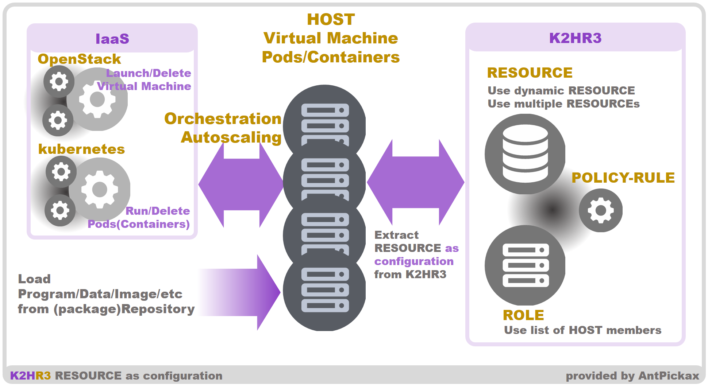

# Other Usage
This section introduces other uses using the K2HR3 system.

## Correspondence to orchestration
The K2HR3 system provides a means to make it easier to deal with **orchestration and autoscaling**.  

In order to **support orchestration and autoscaling**, it is necessary to automatically scale the programs(applications) that are placed and relocated, and the data they manage.  
The scaling of dynamically changing data managed by a programs(applications) needs to be handled by themselves.  
_For example, K2HDKC (made with CHMPX and K2HASH) that AntPickax provides as OSS supports this function._  

The K2HR3 system scales the executable file of the programs(applications) and the settings(configuration) required for starting these programs according to the situation, state and environment.

Examples and usage are explained in the following sections.

### Distribute the settings for programs
Programs(applications) that need orchestration and autoscaling compatibility may need to be configured settings according to the situation, state, and environment.

USER can manually scale to create and distribute this settings(configuration) every time the environment changes, but it is **NOT automatically scaling**.  

By registering **dynamic RESOURCE** with K2HR3 system, it is possible to automatically generate settings(configuration) according to the situation, state and environment.  
As a result, when performing autoscaling, the program(application) can distribute only the executable form from the package repository and read the settings(configuration) required at that time from the K2HR3 system as RESOURCE in order to execute them.  
To **dynamically generate RESOURCE**, USER simply registers the RESOURCE described with the template TEMPLATE corresponding to the K2HR3 template engine.  

TEMPLATE can expand data of all ROLE and RESOURCE accessible to USER(ROLE, TENANT), can also use conditional statements, arithmetic operations, and can be used as a template for settings(configuration).  



In this way, the K2HR3 system can support correspondence of **orchestration and autoscaling** by registering **dynamic RESOURCE** by USER.  
Also, if you are planning to use a server that can distribute settings(configuration), you can use the K2HR3 system with RBAC function as a substitute.  


#### Listing HOSTs
If the HOST is started as an instance or Pods(Containers) using IaaS(OpenStack or kubernetes), the HOST changes dynamically.  
In an environment where orchestration and autoscaling are automatically performed by IaaS, it is **difficult** to intervene processing **by USER**.  
If a program(application) or system needs a **list of HOST**, it is necessary to automatically capture the change of this environment.
As explained above, the K2HR3 system makes it possible to **dynamically enumerate this list of HOSTs** to be challenged.

If the situation requires a list of HOST groups as in this example, the **K2HR3 system will help it**.

## Dynamic distribution of keys
There are programs(applications) that use keys(common key, public key, secret key etc) to access other systems.  

Consider the case of updating keys in an environment using such a program(application).  
In general, the administrator redistributes the keys and restarts the program(application).  

By using the K2HR3 system, we can propose to **simplify this distribution process**.  
Using **+SERVICE** feature, SERVICE **OWNER** can register **keys into RESOURCE** for SERVICE **MEMBER**.  

With this procedure, OWNER can freely change the key, and MEMBER which has some HOST grouped can acquire updated, changed, and added keys at an arbitrary timing.  
The K2HR3 system can **safely manage keys** and **control access to that key as RBAC**.  


In the above figure, OWNER can **exchange keys without consideration to MEMBER**, if the program(application) or the system detects change of the key and can reread the key.  
Although USER can provide a system for distributing/updating keys, it is **difficult** to provide a system that supports RBAC function and supports IaaS(OpenStack and kubernetes), like the +SERVICE feature supports OWNER and MEMBER.  

USER can reduce the cost and build a safe system by using K2HR3 system which these are already implemented and can easily provide.  

## Additional processing at automatic registration/deletion
When automatically registering/deleting virtual computing(Virtual Machine) with OpenStack, you can install packages and start/stop Systemd services.

### Processing at automatic registration in OpenStack
When auto-registering a virtual computing(Virtual Machine) with OpenStack, you can install packages and start Systemd services at the same time.  
To perform this process, specify the package name and Systemd service name in the RESOURCE corresponding to the ROLE that registers the virtual computing(Virtual Machine).  

For example, suppose the registration destination ROLE is the following YRN path.  
```
yrn:yahoo:::mytenant:role:myhosts
```
In this case, the package name and Systemd service name can be set in the KEYS data of the RESOURCE of the following YRN path.
```
yrn:yahoo:::mytenant:resoruce:myhosts
```
- k2hr3-init-packages  
List the name of the package to be installed in the value of this key.(The separator is specified by `,`.)
- k2hr3-init-packagecloud-packages  
If you want to install the package provided by AntPickax at [packagecloud.io](https://packagecloud.io/antpickax/stable), enumerate the package name in the value of this KEY.
- k2hr3-init-systemd-packages  
List the Systemd service name you want to start in the value of this KEY.

### Processing at automatic deletion in OpenStack
When you delete a virtual computing(Virtual Machine) in OpenStack, you can stop the Systemd service at the same time.  
To perform this process, specify the Systemd service name in the RESOURCE corresponding to the ROLE in which the virtual computing(Virtual Machine) is registered.  

For the KEYS data of the RESOURCE, the same `k2hr3-init-systemd-packages` as at the time of registration is used.  
In other words, Systemd services that started during registration can be automatically stopped when deleted.  

## Other examples
We will continue to add cases to this document in the future.

