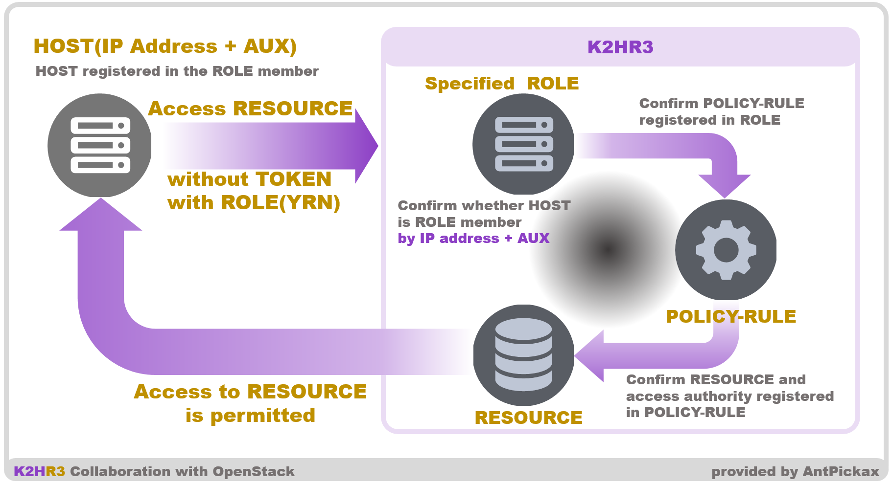
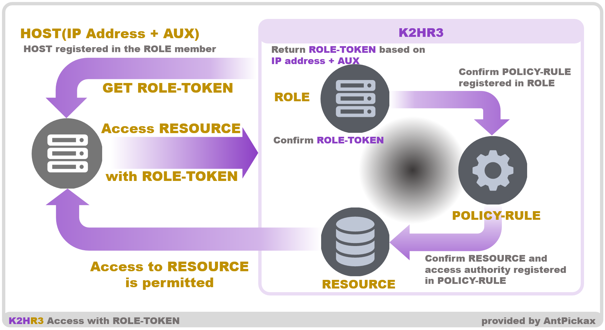
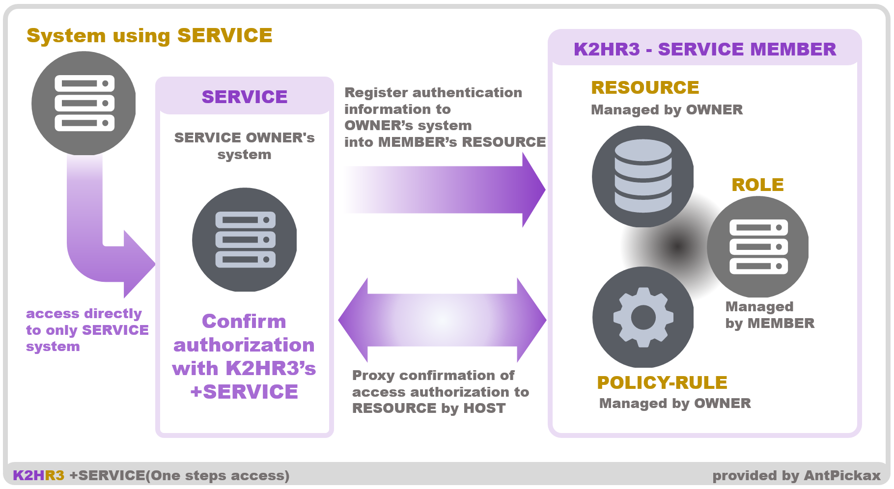

# **RBAC**（**R**ole **B**ased **A**ccess **C**ontrol）の使い方
K2HR3システムを使うことで、リソース（RESOURCE）へのロール（ROLE）ベースのアクセス制御 **RBAC**（**R**ole **B**ased **A**ccess **C**ontrol）ができます。  

K2HR3システムを使う前に、ロール（ROLE）、ポリシー/ルール（POLICY）、リソース（RESOURCE）、サービス（SERVICE）を設定している必要があります。  
これらの設定方法については、[K2HR3システムの使い方](usageja.html)を参照してください。

## 概要
K2HR3システムは、リソース（RESOURCE）に対するアクセスを**RBAC**（**R**ole **B**ased **A**ccess **C**ontrol）として提供します。  
RBACとしてのアクセス元は、ロール（ROLE）で管理され、個々のアクセスはロール（ROLE）に登録されているメンバーであるホスト（HOST）です。  
RBACとしての制御は、ポリシー/ルール（POLICY）で管理し、実行されます。  

RBACとして動作するためのこれらの設定をリソース（RESOURCE）の提供側と利用側で簡単な管理ができるようにするための機能が、+サービス（+SERVICE）機能です。  
サービス（SERVICE）は、+サービス（+SERVICE）機能を利用するために設定するデータです。  

このRBACの使い方では、K2HR3システムのRBAC機能を使うための方法を説明します。

### リソース（RESOURCE）アクセス
K2HR3システムのリソース（RESOURCE）へのアクセス方法は、トークン（TOKEN）無し/トークン（TOKEN）有りの方法があります。  
またトークン（TOKEN）は、ユーザ（USER）単位とロール（ROLE）単位で発行されたトークン（TOKEN）があります。  
トークン（TOKEN）によるK2HR3システムへのアクセス方法の詳細については、[K2HR3 REST API](https://k2hr3.antpick.ax/apija.html)も参照してください。

## トークン（TOKEN）無しでリソース（RESOURCE）へアクセス
トークン（TOKEN）無しで、リソース（RESOURCE）のデータを取得することができます。  
_トークン（TOKEN）については、[K2HR3 REST API](apija.html)を参照してください。_

ロール（ROLE）に登録されているホスト（HOST）からK2HR3のREST APIを利用して、リソース（RESOURCE）を取得する場合、**トークン（TOKEN）無しでリソース（RESOURCE）を取得**することができます。  

### 詳細
通常、アクセス制御を行う場合、トークン（TOKEN）やIPアドレス、Cookieなどを使い、アクセス権限があるか確認します。  
K2HR3システムでは、IPアドレスと付加情報により、アクセス権限の確認と認証・認可ができます。  

この処理の流れを以下に示します。
1. ホスト（HOST）がREST APIを使いリソース（RESOURCE）をリクエスト
1. K2HR3システムがホスト（HOST）のロール（ROLE）を確認
1. ロール（ROLE）のリソース（RESOURCE）アクセスの権限を確認
1. ホスト（HOST）にリソース（RESOURCE）を返信

上記のように、予め設定されているロール（ROLE）のメンバーであるホスト（HOST）であれば、トークン（TOKEN）なしでリソース（RESOURCE）へのアクセスが可能です。



### 例
以下のように[RESOURCE API](api_resourceja.html)を使い、予めロール（ROLE）に登録されているホスト（HOST）からリソース（RESOURCE）を取得します。  
```
GET http://<K2HR3 API server host[:port]/v1/resource/<RESOURCE YRN PATH>?role=<ROLE YRN PATH>&type=<TYPE>
```
上記のパラメータ他を説明します。
- RESOURCE YRN PATH  
取得するリソース（RESOURCE）の[YRN](detail_variousja.html)フルパスを指定します。
- ROLE YRN PATH  
ホスト（HOST）が登録されているロール（ROLE）の[YRN](detail_variousja.html)フルパスを指定します。
- TYPE  
取得するリソース（RESOURCE）の内容の種別を指定します。

このように、REST APIのリクエストにはトークン（TOKEN）を指定せず、リソース（RESOURCE）を取得することができます。

## トークン（TOKEN）有りでリソース（RESOURCE）へアクセス
トークン（TOKEN）有りで、リソース（RESOURCE）のデータを取得もできます。  
トークン（TOKEN）無しでリソース（RESOURCE）にアクセスする場合とほぼ同じですが、トークン（TOKEN）を指定し、IPアドレスによる認証・認可ではなく、トークン（TOKEN）によるロール（ROLE）の判定を行う違いがあります。  
このアクセス方法は、一般的なRBACシステムと同等です。  

詳しくは、[RESOURCE API](api_resourceja.html)などの説明を参照してください。  
_ここではK2HR3システムの特徴としての説明に限定します。_



## +サービス（+SERVICE）機能による連携（１）
K2HR3システムの+サービス（+SERVICE）機能を利用したサービス（SERVICE）の提供方法の1つを説明します。  
これは、以下の図のようなサービス（SERVICE）の所有側（OWNER）のシステムが**専用の認証・認可**（K2HR3のRBACとは別）を持つケースです。  


### フロー
上図のフローは以下のようになっています。

#### サービス（SERVICE）の所有側（OWNER）
サービス（SERVICE）の所有側（OWNER）が機能・情報を提供しています。  
この機能・情報にアクセスするには、所有側（OWNER）のシステムの**専用の認証・認可**（K2HR3のRBACとは別）が必要です。

#### サービス（SERVICE）の利用側（MEMBER）
サービス（SERVICE）の利用側（MEMBER）は、所有側（OWNER）のシステムにアクセスし、機能・情報を利用します。  
この機能・情報を利用するには、上述の**専用の認証・認可**が必要です。

### シーケンス
サービス（SERVICE）の利用側（MEMBER）が、所有側（OWNER）の機能・情報を利用できるまでの流れを示します。

#### K2HR3システムへの設定
所有側（OWNER）と利用側（MEMBER）は、それぞれでサービス（SERVICE）の利用のための設定をします。  

所有側（OWNER）の設定では、リソース（RESOURCE）に所有側（OWNER）のシステムの**専用の認証・認可**の情報を設定します。  
リソース（RESOURCE）は静的・動的のいずれでも可能です。  
**専用の認証・認可**が専用のトークンなどである場合は、動的なリソース（RESOURCE）を選択し、VERIFY URLにより利用側（MEMBER）に応じたトークンをリソース（RESOURCE）に設定できるようにするとよいでしょう。

利用側（MEMBER）は、サービス（SERVICE）の連携を行い、アクセス元となるホスト（HOST）を連携させたロール（ROLE）に登録しておきます。

#### アクセス（１）
利用側（MEMBER）は、K2HR3システムにアクセスし（トークン（TOKEN）無しでREST APIを利用する）、サービス（SERVICE）連携したリソース（RESOURCE）を取得します。  
ここで取得できるリソース（RESOURCE）は、**専用の認証・認可**のための情報そのものです。  

#### アクセス（２）
利用側（MEMBER）は、アクセス（１）で取得した**専用の認証・認可**のための情報を使って、所有側（OWNER）のシステムにアクセスできます。

### 何が可能となったのか
サービス（SERVICE）を利用して、**専用の認証・認可**を持つ所有側（OWNER）のシステムに対して、利用側（MEMBER）は、**専用の認証・認可**の情報の**中身を知らないまま**アクセスが可能となりました。  
つまり、以下のメリットがあります。

- **専用の認証・認可を利用側（MEMBER）に隠蔽可能**
- **所有側（OWNER）は専用の認証・認可を自由に変更可能**
- **利用側（MEMBER）は一切のトークンなどの処理が不要**

システムを提供する側、利用する側ともに疎結合できており、その結合方法を知る必要がありません。  
連携させるための管理は、K2HR3システム上で双方が分離して設定・管理することができます。

## +サービス（+SERVICE）機能による連携（２）
K2HR3システムの+サービス（+SERVICE）機能を利用したサービス（SERVICE）のもう一つの提供方法を説明します。  
これは、以下の図のようなサービス（SERVICE）の所有側（OWNER）のシステムが**認証・認可をK2HR3システムに委譲する**ケースです。  



### 構成
上図の構成は以下のようになっています。

#### サービス（SERVICE）の所有側（OWNER）
サービス（SERVICE）の所有側（OWNER）が機能・情報を提供しています。  
この機能・情報にアクセスする際、専用の認証・認可は不要であり、その代わりK2HR3システムに利用側（MEMBER）のロール（ROLE）を確認するための情報を受け取ります。  

#### サービス（SERVICE）の利用側（MEMBER）
サービス（SERVICE）の利用側（MEMBER）は、所有側（OWNER）のシステムにアクセスし、機能・情報を利用します。  

### シーケンス
サービス（SERVICE）の利用側（MEMBER）が、所有側（OWNER）の機能・情報を利用できるまでの流れを示します。

#### K2HR3システムへの設定
所有側（OWNER）と利用側（MEMBER）は、それぞれでサービス（SERVICE）の利用のための設定をします。  

所有側（OWNER）の設定では、リソース（RESOURCE）に所有側（OWNER）のシステムで確認できる情報（フラグでも可）を設定しておきます。  
リソース（RESOURCE）は静的で可能です。  
この確認できる情報は、サービス（SERVICE）連携の許可がなされているときに取り出せる値というだけです。  
この値が取り出せる意味は、アクセスが認可されたということになります。

利用側（MEMBER）は、サービス（SERVICE）の連携を行い、アクセス元となるホスト（HOST）を連携させたロール（ROLE）に登録しておきます。

#### アクセス（１）
利用側（MEMBER）は、直接所有側（OWNER）のシステムにアクセスします。  
このとき、利用側（MEMBER）のホスト（HOST）情報を一緒にパラメータとして渡します。  
この渡す情報は、REST APIにトークン（TOKEN）なしでアクセスする情報と同じです。  
_所有側（OWNER）のシステムが信頼できるならトークン（TOKEN）を渡すことも可能ではあります。_

#### アクセス（２）
所有側（OWNER）は、アクセス（１）で受け取った利用側（MEMBER）のホスト（HOST）情報とそのIPアドレスなどをK2HR3 REST APIに渡し、利用側（MEMBER）が連携したリソース（RESOURCE）を取得します。  
リソース（RESOURCE）は、所有側（OWNER）が設定した値そのものです。  
利用側（MEMBER）のホスト（HOST）が正しいロール（ROLE）メンバーであれば、リソース（RESOURCE）の取得が成功します。  

リソース（RESOURCE）取得の成功を確認後、所有側（OWNER）のシステムは、自身の処理を行い機能・情報を利用側（MEMBER）に返します。

### 何が可能となったのか
サービス（SERVICE）を利用して、所有側（OWNER）は専用の認証・認可を**必要とせず**、利用側（MEMBER）はK2HR3システムの必要とするホスト（HOST）情報を渡し、1度だけのアクセスで、所有側（OWNER）システムが利用可能となりました。  

つまり、以下のメリットがあります。

- **利用側（MEMBER）は、所有側（OWNER）システムへの1度のアクセスのみ**  
_K2HR3のREST APIにアクセスするときと同じ情報を付与する_
- **所有側（OWNER）は専用の認証・認可が不要**  
_認可はK2HR3システムに委譲_
- **利用側（MEMBER）、所有側（OWNER）の双方そもトークンなどの処理が不要**

そして、最大のメリットは **所有側（OWNER）が内部で使う利用側（MEMBER）固有のリソース（RESOURCE）を、利用側（MEMBER）に見せる必要がない** ことです。  
これにより、所有側（OWNER）は任意のタイミングで自由にロジック・リソース（RESOURCE）の変更が可能であり、セキュリティ面でも優位とできます。  
_リソース（RESOURCE）は利用側（MEMBER）固有でなくても同じです。_  

システムを提供する側と利用する側のAPIを簡素にすることができ、独自の認証・認可も不要となります。  
連携させるための管理は、K2HR3システム上で双方が分離して設定・管理することができます。

